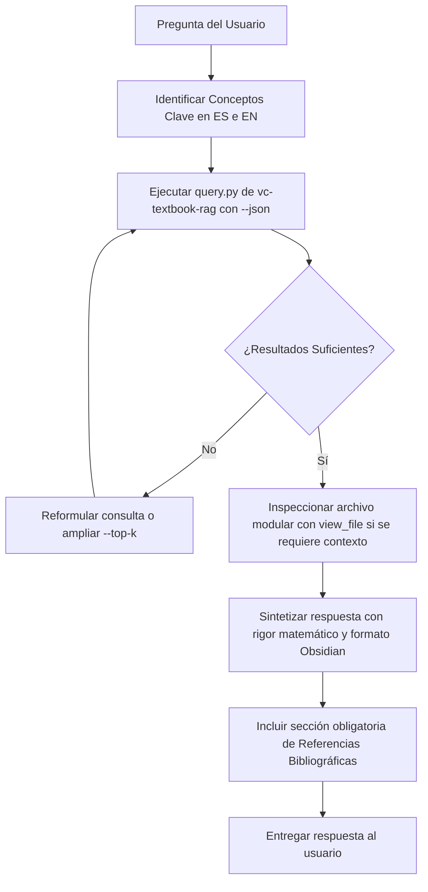

# Directivas para Agentes de IA — Repositorio VC_APUNTES

Este archivo define el contexto, la estructura del proyecto y las **directivas de obligado cumplimiento** para cualquier agente de inteligencia artificial (incluyendo Antigravity, Claude, Gemini, GPT y herramientas CLI/IDE) que opere en este repositorio.

---

## 1. Descripción del Repositorio

**VC_APUNTES** es un repositorio colaborativo y *Vault* de [Obsidian](https://obsidian.md/) diseñado para la asignatura de **Visión por Computador** (Grado / Máster en Informática, UGR).

El propósito del repositorio es doble:
1. **Vault de Apuntes de Alta Calidad:** Albergar apuntes teóricos y prácticos rigurosos, explicados de forma intuitiva, con fórmulas matemáticas en KaTeX, leyendas explicativas, diagramas Mermaid y bloques de notas (*callouts* de Obsidian).
2. **Motor RAG Canónico Integrado:** Disponer de una base de datos vectorial local ([LanceDB](https://lancedb.com/) + [FastEmbed](https://qdrant.github.io/fastembed/)) que indexa los libros de texto canónicos de la disciplina procesados a Markdown modular en `docs_clase/textBook/`.

---

## 2. Estructura del Repositorio

```text
VC_APUNTES/
├── AGENTS.md                         # Directivas y contexto para agentes de IA (este archivo)
├── README.md                         # Portada y guía general del vault
├── CONTRIBUTING.md                   # Normas de colaboración y estilo para estudiantes
├── setup.sh                          # Script de inicialización automatizada en un solo paso
│
├── Tema 1/ ... Tema 5/               # Apuntes estructurados de la asignatura en Obsidian
│   ├── Tema 1/                       # Introducción, historia, dificultades y aplicaciones
│   ├── Tema 2/                       # Representación, filtrado espacial, frecuencia y bordes
│   ├── Tema 3/                       # Machine Learning clásico, texturas, Blobs, SIFT, HOG, Harris
│   ├── Tema 4/                       # Deep Learning, Convoluciones, Arquitecturas CNN
│   └── Tema 5/                       # Segmentación semántica, detección de objetos y evaluación
│
├── docs_clase/                       # Material docente y bibliografía procesada
│   ├── T1/, T2/                      # Diapositivas oficiales de clase y anotaciones
│   └── textBook/                     # Libros canónicos divididos en Markdown modular con imágenes
│       ├── Szeliski/                 # R. Szeliski (2022) - Computer Vision: Alg. & Appl. (2nd Ed.)
│       ├── Forsyth_Ponce/            # D. Forsyth & J. Ponce (2012) - Computer Vision (2nd Ed.)
│       ├── Hartley_Zisserman/        # R. Hartley & A. Zisserman (2011) - Multiple View Geometry
│       ├── Prince_UDL/               # Simon J.D. Prince (2023) - Understanding Deep Learning
│       ├── Torralba_Foundations/     # A. Torralba, P. Isola, W.T. Freeman (2024) - Foundations of CV
│       └── Matrix_Calculus/          # P. Bright, A. Edelman, S.G. Johnson (2025) - Matrix Calculus
│
├── .agents/skills/vc-textbook-rag/   # Skill de IA: Buscador semántico vectorial
│   ├── SKILL.md                      # Especificación de la skill RAG
│   ├── data/lancedb/                 # Base de datos vectorial persistente (textbook_chunks.lance)
│   └── scripts/
│       ├── query.py                  # Script de búsqueda semántica (CLI y formato JSON)
│       └── build_index.py            # Generador/reconstructor del índice vectorial
│
└── scripts/                          # Herramientas de preparación del entorno
    ├── books_config.json             # Catálogo de libros y metadatos de ingestión
    ├── process_textbooks.py          # Extracción y modularización de PDFs a Markdown
    └── setup_repo.py                 # Instalación y verificación del entorno
```

---

## 3. DIRECTIVAS OBLIGATORIAS PARA EL AGENTE

> [!CAUTION]
> **REGLAS CRÍTICAS DE ACCIÓN INMEDIATA:**
> Todo agente que responda dudas, redacte, resuma o modifique apuntes en este repositorio DEBE acatar de forma estricta las dos directivas siguientes. No se admiten excepciones.

### 🔴 Directiva 1: Uso Obligatorio de la Skill `vc-textbook-rag`

Para responder a **cualquier pregunta conceptual, teórica, algorítmica, matemática o de diseño** sobre Visión por Computador, el agente **DEBE consultar y basarse en la skill** [`.agents/skills/vc-textbook-rag`](.agents/skills/vc-textbook-rag/SKILL.md).

* **Prohibido responder exclusivamente con memoria paramétrica:** No alucines definiciones ni resumas de memoria cuando la literatura de referencia está indexada en el repositorio.
* **Consulta semántica previa:** Antes de formular una respuesta técnica, ejecuta la búsqueda semántica mediante el script de la skill:
  ```bash
  uv run --with lancedb,fastembed python3 .agents/skills/vc-textbook-rag/scripts/query.py "<consulta en español o inglés>" --top-k 4 --json
  ```
* **Filtros por autor/libro:** Si la pregunta concierne a un autor o enfoque específico, utiliza la opción `--book` (`szeliski`, `forsyth`, etc.):
  ```bash
  uv run --with lancedb,fastembed python3 .agents/skills/vc-textbook-rag/scripts/query.py "filtro bilateral" --book szeliski --json
  ```
* **Inspección de archivos fuente:** Cuando el RAG devuelva fragmentos relevantes, utiliza las herramientas de lectura de archivos (`view_file`) sobre la ruta relativa devuelta en `file_path` (por ejemplo, `docs_clase/textBook/Szeliski/...`) para acceder al capítulo completo, figuras asociadas y demostraciones matemáticas íntegras.

---

### 🔴 Directiva 2: Obligatoriedad de Referencias Bibliográficas

**TODA respuesta generada por el agente debe ir rigurosamente acompañada de referencias bibliográficas precisas y formales.**

* **No se permiten respuestas sin citación:** Al final de cualquier respuesta o al final de cualquier nota redactada/editada, debe figurar una sección explícita de referencias bibliográficas.
* **Estructura requerida de cada cita:**
  1. **Autores:** Nombre completo o formato estándar (ej. *Richard Szeliski*, *David Forsyth & Jean Ponce*).
  2. **Título de la obra:** En cursiva con indicación de edición o año (ej. *Computer Vision: Algorithms and Applications (2nd Edition, 2022)*).
  3. **Capítulo y Sección:** Nombre y número exacto del capítulo/sección de donde procede la información.
  4. **Páginas / Ubicación:** Páginas del PDF si constan en los metadatos.
  5. **Ruta del archivo en el Vault:** Enlace en formato markdown al archivo modular del libro (ej. `[Szeliski - Chapter 3](file:///.../docs_clase/textBook/Szeliski/...)`).

#### Plantilla estándar de citación:
```markdown
### 📚 Referencias Bibliográficas

- **Szeliski, Richard** (2022). *Computer Vision: Algorithms and Applications* (2nd ed.).
  - **Capítulo / Sección:** Chapter 3: Image processing $\to$ Section 3.3.1: *Bilateral filter*.
  - **Archivo local:** [`docs_clase/textBook/Szeliski/Chapter_03_Image_processing/03.3_Neighborhood_operators.md`](docs_clase/textBook/Szeliski/Chapter_03_Image_processing/03.3_Neighborhood_operators.md)
- **Torralba, Antonio; Isola, Phillip; Freeman, William T.** (2024). *Foundations of Computer Vision*. MIT Press.
  - **Capítulo / Sección:** Filter Banks $\to$ *Steerable Quadrature Pairs*.
  - **Archivo local:** [`docs_clase/textBook/Torralba_Foundations/spatial_filter_sets.md`](docs_clase/textBook/Torralba_Foundations/spatial_filter_sets.md)
```

---

## 4. Protocolo de Trabajo del Agente (Paso a Paso)

Ante cualquier petición del usuario sobre Visión por Computador:



1. **Recepción e Identificación:** Extraer las entidades matemáticas y algorítmicas clave tanto en español como en inglés (p. ej. *filtro bilateral* $\leftrightarrow$ *bilateral filter*, *geometría epipolar* $\leftrightarrow$ *epipolar geometry*).
2. **Consulta Vectorial:** Ejecutar `query.py` con `--top-k 4 --json` a través de `uv run`.
3. **Profundización Documental:** Si los fragmentos devueltos requieren mayor contexto (deducciones paso a paso, gráficas o tablas), examinar el archivo Markdown modular mediante `view_file`.
4. **Redacción con Estilo del Vault:** Formatear la explicación respetando las directrices de Obsidian (KaTeX para fórmulas con su leyenda matemática, callouts de advertencia o información, diagramas Mermaid).
5. **Cierre con Bibliografía:** Cerrar obligatoriamente con el bloque de referencias bibliográficas detallado.

---

## 5. Estándares de Estilo y Formato para los Apuntes (Obsidian)

Cuando el agente redacte o edite notas en `Tema 1/` ... `Tema 5/`, debe seguir las normas acordadas en [CONTRIBUTING.md](CONTRIBUTING.md):

### A. Fórmulas Matemáticas y Notación (KaTeX)
* Expresiones en línea con `$...$` y en bloque con `$$...$$`.
* **Leyenda Matemática Obligatoria:** Tras toda fórmula principal, se debe incluir un callout explicando cada término:
  ```markdown
  $$ I_B(x) = \frac{1}{W_p} \sum_{x_i \in \Omega} I(x_i) f_r(\|I(x_i) - I(x)\|) g_s(\|x_i - x\|) $$

  > [!info] Leyenda Matemática
  > - $I(x)$: Intensidad del píxel central.
  > - $g_s$: Kernel gaussiano espacial (distancia geométrica).
  > - $f_r$: Kernel gaussiano de rango (diferencia fotométrica de intensidades).
  > - $W_p$: Factor de normalización para asegurar la conservación de energía.
  ```

### B. Callouts de Obsidian
Utilizar la sintaxis nativa de callouts para estructurar pedagógicamente el contenido:
* `> [!info]` Definiciones clave, intuiciones conceptuales y leyendas matemáticas.
* `> [!tip]` Recomendaciones de implementación, optimización o trucos para exámenes.
* `> [!warning]` Casos degenerados, fallos habituales de algoritmos o limitaciones teóricas.
* `> [!example]` Ejemplos numéricos resueltos paso a paso.

### C. Diagramas Mermaid
* No insertar imágenes binarias si el concepto puede explicarse con un diagrama `mermaid` (`graph TD`, `flowchart LR`, etc.).

---

## 6. Comandos de Mantenimiento y Utilidades

* **Ejecutar consulta en consola (salida amigable):**
  ```bash
  uv run --with lancedb,fastembed python3 .agents/skills/vc-textbook-rag/scripts/query.py "harris corner detector"
  ```
* **Ejecutar consulta programmatic (JSON para agentes):**
  ```bash
  uv run --with lancedb,fastembed python3 .agents/skills/vc-textbook-rag/scripts/query.py "canny edge detector hysteresis" --top-k 3 --json
  ```
* **Reconstruir índice vectorial (si se agregan nuevos documentos o libros):**
  ```bash
  uv run --with lancedb,fastembed,pyyaml python3 .agents/skills/vc-textbook-rag/scripts/build_index.py --force
  ```
