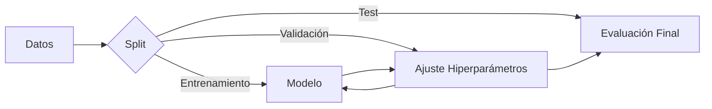

# Introducción al Machine Learning

## Definición y Conceptos Básicos
El **Machine Learning (Aprendizaje Automático)** dota a las máquinas de la capacidad de aprender automáticamente a partir de datos, sin ser programadas explícitamente para una tarea específica.
> *Datos + Algoritmos de Aprendizaje = Machine Learning*

### Paradigmas Principales
1.  **Aprendizaje Supervisado (Supervised Learning):**
    *   Tenemos datos de entrada ($X$) y sus etiquetas/salidas esperadas ($Y$).
    *   *Objetivo:* Aprender un mapeo $f: X \to Y$.
    *   *Ejemplos:* Clasificación (gato vs perro), Regresión (predecir precio vivienda).
2.  **Aprendizaje No Supervisado (Unsupervised Learning):**
    *   Solo tenemos datos de entrada ($X$), sin etiquetas.
    *   *Objetivo:* Encontrar patrones o estructuras subyacentes.
    *   *Ejemplos:* Clustering (agrupamiento), Reducción de dimensionalidad.
3.  **Aprendizaje por Refuerzo (Reinforcement Learning):**
    *   Un agente aprende actuando en un entorno y recibiendo recompensas o castigos.

## Modelos Lineales
Son la base de muchos algoritmos complejos. Aprenden **pesos** ($w$) para combinar las características de entrada.

### Regresión Lineal
$$ y = w_0 + w_1x_1 + \dots + w_dx_d $$
> [!info] Leyenda
> *   $y$: Predicción.
> *   $w_i$: Pesos aprendidos ($w_0$ es el sesgo/bias).
> *   $x_i$: Características de entrada.

### Regresión Logística (Clasificación)
Usa una función de activación no lineal (sigmoide) para comprimir la salida entre 0 y 1 (probabilidad).
$$ h(x) = \sigma(w^T x) = \frac{1}{1 + e^{-w^T x}} $$
*Aunque usa una función no lineal, la frontera de decisión sigue siendo lineal.*

## Optimización y Entrenamiento
El entrenamiento se plantea como un problema de optimización: **Minimizar una función de pérdida (Loss Function)**.

*   **Función de Pérdida ($E$):** Mide qué tan mal lo hace el modelo.
    *   *Regresión:* Error Cuadrático Medio (MSE).
    *   *Clasificación:* Entropía Cruzada (Cross-entropy).
*   **Descenso del Gradiente:** Algoritmo iterativo para ajustar los pesos moviéndose en la dirección opuesta al gradiente del error.
$$ w_{nuevo} = w_{viejo} - \eta \cdot \frac{\partial E}{\partial w} $$
> [!info] Leyenda
> *   $\eta$ (eta): Tasa de aprendizaje (Learning Rate). Controla el tamaño del paso.
> *   $\frac{\partial E}{\partial w}$: Gradiente (derivada) del error respecto al peso.

## Generalización y Overfitting
El objetivo final no es memorizar los datos de entrenamiento, sino **generalizar** a datos nuevos (test).

*   **Overfitting (Sobreajuste):** El modelo aprende el "ruido" o detalles específicos del entrenamiento y falla en test.
    *   *Síntoma:* Error de entrenamiento bajo, error de validación alto.
    *   *Soluciones:* Regularización (L1/L2), Dropout, Data Augmentation, Early Stopping.
*   **Bias-Variance Tradeoff:**
    *   *Bias alto:* Modelo muy simple (Underfitting).
    *   *Varianza alta:* Modelo muy complejo, sensible a cambios en los datos (Overfitting).

### Protocolos de Validación
Para estimar el error real de manera fiable:
1.  **Hold-out:** Separar datos en Train/Val/Test (ej. 80/10/10). Rápido pero depende de la partición.
2.  **Cross-Validation (k-fold):** Dividir en $k$ partes, entrenar en $k-1$ y validar en 1. Rotar $k$ veces y promediar. Más robusto.
3.  **Leave-one-out:** Caso extremo de CV donde $k = N$ (número de datos).

## Data Snooping (Trampa de datos)
Ocurre cuando información del conjunto de test se "filtra" al diseño del modelo (ej: normalizar los datos usando la media de todo el dataset en lugar de solo la de train). **Regla de oro:** El conjunto de test debe estar en una "caja fuerte" hasta el final.
