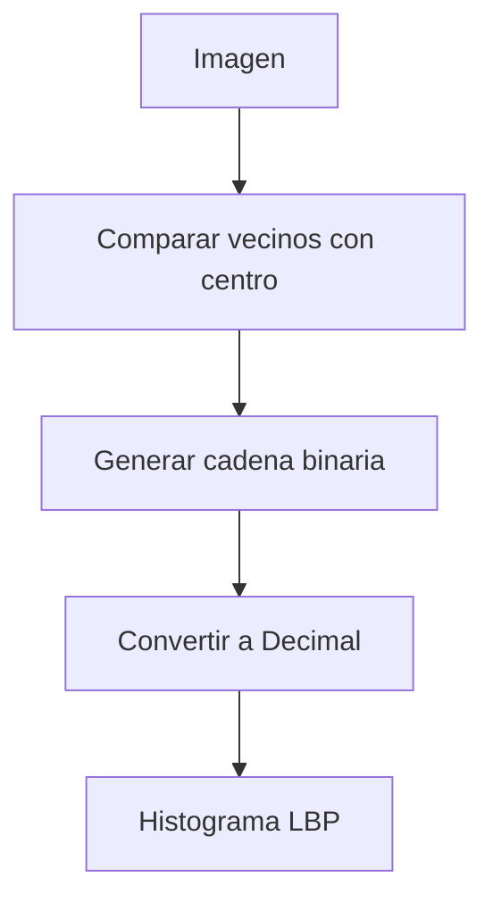

# Template Matching y Texturas

## Template Matching (Coincidencia de Patrones)
Técnica para encontrar partes de una imagen que coinciden con un patrón (template).
*Idea clave:* Usar el patrón como un filtro.

### Métodos de Comparación
1.  **Correlación Cruzada:** Maximizamos el producto punto. Problema: Sensible a cambios de intensidad (brillo).
2.  **Suma de Diferencias Cuadráticas (SSD):** Minimizamos la diferencia. $SSD = \sum (T - I)^2$. Sensible al brillo.
3.  **Correlación Cruzada Normalizada (NCC):** La más robusta. Invariante a cambios afines de iluminación (escala y offset).
    $$ NCC = \frac{\sum (T - \bar{T})(I - \bar{I})}{\sqrt{\sum(T-\bar{T})^2 \sum(I-\bar{I})^2}} $$ 
> [!info]  Leyenda
> *   $T, I$: Intensidades del template e imagen.
> *   $\bar{T}, \bar{I}$: Medias de intensidad (restar la media centra los datos en 0).
> *   El denominador normaliza la energía (varianza), haciendo el resultado invariante al contraste.

## Transformada de Hough
Técnica de votación para detectar formas parametrizables (líneas, círculos) robusta ante ruido y oclusiones parciales.

### Detección de Líneas
Una línea en la imagen ($y = mx + c$) es un punto en el **Espacio de Parámetros** $(m, c)$.
*   **Problema:** $m$ puede ser infinito (líneas verticales).
*   **Solución (Espacio $\rho, \theta$):** Usar coordenadas polares.
    $$ x \cos\theta + y \sin\theta = \rho $$ 
> [!info] Leyenda
> *   $\rho$: Distancia de la línea al origen.
> *   $\theta$ : Ángulo de la normal a la línea.

**Algoritmo:**
1.  Discretizar el espacio de parámetros $(\rho, \theta)$ en celdas (acumulador).
2.  Para cada punto de borde $(x,y)$ en la imagen, "votar" por todas las posibles líneas que pasan por él (curva sinusoidal en el espacio de parámetros).
3.  Los picos locales en el acumulador corresponden a las líneas detectadas.

*   **Generalizada:** Para formas no analíticas, se usa una tabla-R para aprender la geometría relativa al centro del objeto.

## Representación de Texturas
La textura se define por la repetición de elementos básicos (**textones**) con propiedades estadísticas similares.

### 1. Características de Haralick (GLCM)
Basadas en la **Matriz de Co-ocurrencia de Niveles de Gris (GLCM)**.
*   Registra cuántas veces un píxel con valor $i$ es adyacente a uno con valor $j$.
*   Se extraen estadísticos: Contraste, Correlación, Energía, Homogeneidad.

### 2. Patrones Binarios Locales (LBP)
Descriptor de textura muy eficiente y robusto a cambios monótonos de iluminación.
**Proceso:**
1.  Comparar cada píxel con sus vecinos (ej. 3x3).
2.  Si vecino $\ge$ centro $\to 1$, si no $\to 0$.
3.  Leer los bits en orden (horario/antihorario) para formar un número decimal (0-255).
4.  Calcular el histograma de estos números para la región.

