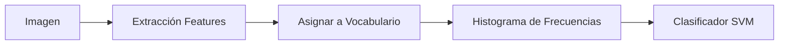

# Bag of Words (BoW) y Detección de Blobs

## Bag of Words (Bolsa de Palabras)
Modelo inspirado en procesamiento de texto. Representa una imagen como un **histograma de frecuencias** de "palabras visuales", perdiendo la información espacial.

### Pipeline Estándar
1.  **Extracción de Características:** Detectar keypoints (SIFT) o usar una rejilla densa (Dense SIFT).
2.  **Construcción del Vocabulario (Codebook):**
    *   Agrupar todos los descriptores de todas las imágenes de entrenamiento.
    *   Usar **K-Means** para encontrar $K$ centros (palabras visuales).
3.  **Cuantización:** Asignar cada descriptor de una imagen a la palabra visual más cercana.
4.  **Representación:** Crear un histograma con la frecuencia de cada palabra visual.
5.  **Clasificación:** Usar el histograma como vector de entrada para un clasificador (SVM, KNN).

### Pirámide Espacial (Spatial Pyramid)
Extensión de BoW para recuperar información espacial.
*   Divide la imagen en niveles (1x1, 2x2, 4x4...). 
*   Calcula histogramas para cada celda y los concatena.
*   Permite distinguir, por ejemplo, cielo (arriba) de playa (abajo).

---

## Detección de Blobs y Selección de Escala
Un "blob" es una región que difiere en propiedades (brillo, color) respecto a su entorno.

### Laplaciana de Gaussiana (LoG)
Filtro ideal para detectar blobs. Tiene forma de "sombrero mexicano" invertido.
$$ \nabla^2_{norm} g = \sigma^2 \left( \frac{\partial^2 g}{\partial x^2} + \frac{\partial^2 g}{\partial y^2} \right) $$
> [!info] Leyenda
> *   $\sigma^2$: Normalización de escala. Necesaria para comparar respuestas a diferentes escalas.
> *   $\nabla^2$: Operador Laplaciano (segunda derivada).

### Selección Automática de Escala
Para detectar blobs de diferentes tamaños, buscamos extremos (máximos/mínimos) en el **Espacio de Escala** (Posición 3D: $x, y, \sigma$).
*   **Escala característica:** La escala $\sigma$ donde la respuesta del filtro LoG es máxima coincide con el tamaño del blob ($r \approx \sigma\sqrt{2}$). 

### Diferencia de Gaussianas (DoG)
Aproximación eficiente de la LoG. Se calcula restando dos imágenes suavizadas con Gaussianas de sigmas consecutivos en una pirámide.
$$ DoG \approx G(k\sigma) - G(\sigma) $$
*Usado en SIFT para detección rápida de keypoints.*
