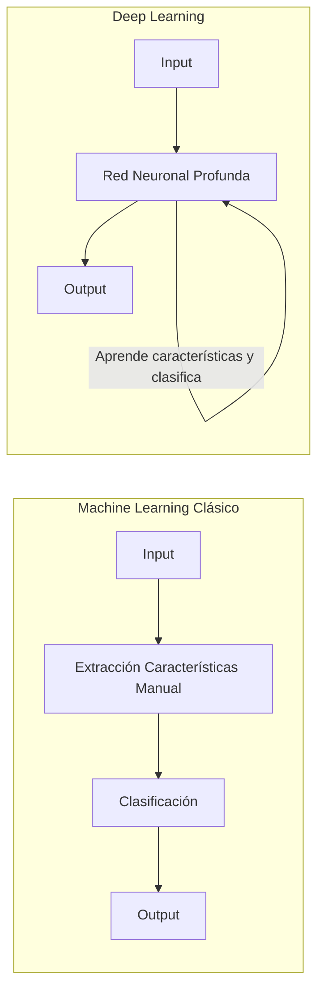

# 01. Introducción al Deep Learning

## ¿Qué es el Deep Learning (DL)?
El Deep Learning es un subcampo del Machine Learning definido por el uso de **redes neuronales profundas**.
*   **Definición oficial:** Modelos computacionales compuestos por múltiples capas de procesamiento para aprender representaciones de datos con múltiples niveles de abstracción.
*   **En la práctica:** Redes neuronales con "muchas" capas ocultas capaces de aproximar funciones complejas.

### Paradigmas de IA
*   **Simbólico / Clásico:** Reglas definidas por humanos (Si A entonces B). Parte del conocimiento (alto nivel).
*   **Sub-simbólico / Conexionista:** Redes neuronales. Parte de los datos (bajo nivel) para aprender reglas.

## ¿Por qué ahora? (El "boom" desde 2012)
Aunque los conceptos existen desde hace décadas (Perceptrón 1958, Backpropagation 1974), la explosión actual se debe a:
1.  **Datos:** Cantidades masivas de datos etiquetados (ej. ImageNet).
2.  **Hardware:** Alta potencia computacional (GPUs).
3.  **Algoritmos:** Avances como ReLU, Dropout, Pre-training.

## Machine Learning vs Deep Learning

| Característica | Machine Learning Clásico | Deep Learning |
| :--- | :--- | :--- |
| **Extracción de características** | Manual (*Feature Engineering*). Expertos diseñan extractores. | **Aprendizaje de representaciones**. La red aprende qué características extraer. |
| **Enfoque** | Dividido: Extracción -> Clasificación. | **End-to-end**: De la entrada a la salida en un solo modelo diferenciable. |
| **Rendimiento** | Se estanca con muchos datos. | Escala mejor con grandes volúmenes de datos. |

## Jerarquía de Representaciones
Las redes profundas aprenden representaciones jerárquicas:
*   **Capas bajas:** Detectan bordes, colores, cambios simples.
*   **Capas medias:** Detectan texturas, partes de objetos (ojos, ruedas).
*   **Capas altas:** Detectan objetos completos y conceptos semánticos.

## Aplicaciones Principales
*   **Visión por Computador:** Reconocimiento de objetos, segmentación, detección de pose, *image captioning*.
*   **Procesamiento de Lenguaje Natural (NLP):** Traducción automática, generación de texto.
*   **Juegos:** Reinforcement Learning (ej. AlphaGo).
*   **Generativo:** Transferencia de estilo, síntesis de imágenes (GANs), *inpainting*.
