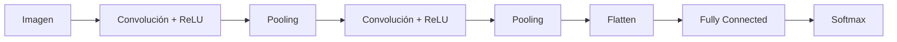

# 02. Redes Neuronales Convolucionales (ConvNets/CNNs)

## Definición
Una red neuronal que incluye **al menos una capa convolucional**. Especialmente diseñadas para procesar datos con estructura de rejilla (como imágenes).

## Capas Fundamentales

### 1. Capa Convolucional (CONV)
Aplica filtros (kernels) aprendibles a la entrada. Preserva la estructura espacial.
*   **Operación:** Producto escalar entre el filtro y una región local de la entrada, deslizándose por toda la imagen.
*   **Propiedades:**
    *   **Conectividad dispersa:** Cada neurona solo ve una pequeña región (campo receptivo).
    *   **Compartición de pesos:** El mismo filtro se usa en toda la imagen (invarianza a traslación, menos parámetros).
    *   **Equivariante a traslación:** Si la entrada se mueve, la salida se mueve igual.

### 2. Capa de Pooling (POOL)
Reduce la dimensionalidad espacial (downsampling) y la cantidad de parámetros.
*   **Tipos:**
    *   **Max Pooling:** Toma el valor máximo de la ventana. (Más común).
    *   **Average Pooling:** Toma el promedio.
*   **Propósito:** Invarianza a pequeñas traslaciones y reducción de coste computacional.

### 3. Capa Totalmente Conectada (FC)
Neuronas conectadas a todas las activaciones de la capa anterior.
*   **Uso:** Típicamente al final de la red para la clasificación final.
*   **Desventaja:** Muchos parámetros, propensa al overfitting.

## Funciones de Activación
Introducen **no linealidad**. Sin ellas, la red sería equivalente a un modelo lineal simple.

*   **Sigmoide / Tanh:** Saturación en los extremos (gradientes cercanos a cero) -> **Problema del desvanecimiento del gradiente** (*Vanishing Gradient*). Ya no se usan mucho en capas ocultas.
*   **ReLU (Rectified Linear Unit):** $f(x) = \max(0, x)$.
    *   **Ventajas:** Acelera el entrenamiento, no satura en la región positiva.
    *   **Problema:** "Dying ReLU" (neuronas que nunca se activan si $x < 0$).
*   **Softmax:** Usada en la capa de salida para clasificación multiclase. Convierte logits en probabilidades que suman 1.

$$ \sigma(z)_i = \frac{e^{z_i}}{\sum_{j=1}^K e^{z_j}} $$
> **Leyenda:**
> *   $\sigma(z)_i$: Probabilidad de la clase $i$.
> *   $z$: Vector de entrada (logits).
> *   $K$: Número total de clases.

## Entrenamiento

### Backpropagation
Algoritmo para calcular el gradiente de la función de pérdida con respecto a los pesos usando la **regla de la cadena**.

### Descenso del Gradiente
Algoritmo de optimización que usa los gradientes calculados por *backprop* para actualizar los pesos.
$$ w^{(t+1)} = w^{(t)} - \eta \nabla E(w^{(t)}) $$
> **Leyenda:**
> *   $w$: Pesos de la red.
> *   $\eta$ (eta): Tasa de aprendizaje (*learning rate*).
> *   $\nabla E$: Gradiente del error.

**Variantes:**
*   **SGD (Estocástico):** Actualiza con cada ejemplo. Ruidoso.
*   **Batch:** Actualiza con todo el dataset. Lento/Costoso en memoria.
*   **Mini-batch:** Actualiza con un subconjunto ($N$ ejemplos). Estándar actual.

## Regularización y Mejora del Entrenamiento
Técnicas para evitar el **Overfitting** (sobreajuste) y acelerar convergencia.

1.  **Dropout:** Apaga aleatoriamente neuronas durante el entrenamiento (con probabilidad $p$). Fuerza a la red a aprender características robustas y redundantes. En test, se usan todas las neuronas (escalando pesos).
2.  **Batch Normalization (BN):** Normaliza las activaciones intermedias (media 0, varianza 1) y luego escala y desplaza.
    *   Acelera el entrenamiento.
    *   Reduce sensibilidad a la inicialización.
    *   Actúa como regularizador leve.
3.  **Data Augmentation:** Generar nuevos datos de entrenamiento transformando los existentes (rotaciones, recortes, cambios de color).
4.  **Early Stopping:** Detener el entrenamiento cuando el error de validación empieza a subir.
