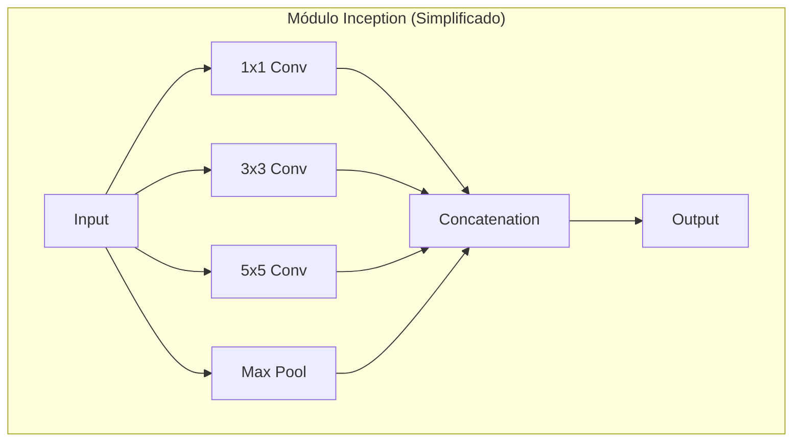
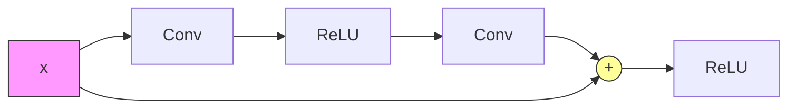

# 03. Arquitecturas de Clasificación de Imágenes

Evolución cronológica de las arquitecturas ganadoras o influyentes en el reto **ILSVRC (ImageNet)**.

## 1. LeNet-5 (1998) - Yann LeCun
*   **Pionera:** Primera CNN exitosa para reconocimiento de dígitos (MNIST).
*   **Estructura:** Conv -> Pool -> Conv -> Pool -> FC.
*   **Características:** Filtros 5x5, Average Pooling, Sigmoides/Tanh. Pocos parámetros (~60k).

## 2. AlexNet (2012) - Krizhevsky et al.
*   **El "Big Bang":** Ganadora de ILSVRC 2012 por gran margen. Inicio de la era moderna del DL.
*   **Mejoras clave:**
    *   Uso de **ReLU** (entrenamiento más rápido).
    *   **Dropout** para regularización.
    *   Entrenamiento en **GPUs**.
    *   Data Augmentation.
*   **Arquitectura:** 8 capas (5 Conv, 3 FC). Filtros iniciales grandes (11x11). ~60M parámetros.

## 3. VGGNet (2014) - Simonyan & Zisserman
*   **Filosofía:** "Pequeños filtros, redes más profundas".
*   **Diseño:** Usa **exclusivamente filtros 3x3** con stride 1 y padding 1.
*   **Por qué 3x3:** Dos capas 3x3 tienen el mismo campo receptivo que una 5x5, y tres 3x3 igual que una 7x7, pero con menos parámetros y más no-linealidades (ReLUs intermedias).
*   **Variantes:** VGG-16 y VGG-19. Muy costosa computacionalmente (muchos parámetros en las capas FC).

## 4. GoogLeNet / Inception (2014) - Szegedy et al.
*   **Eficiencia:** Ganadora 2014. Solo 5M parámetros (vs 60M de AlexNet).
*   **Módulo Inception:** Aplica filtros de diferentes tamaños (1x1, 3x3, 5x5) y pooling **en paralelo**, concatenando los resultados. Permite capturar detalles a varias escalas.
*   **Convoluciones 1x1:** Usadas como "cuello de botella" (*bottleneck*) para reducir la profundidad de los canales antes de filtros costosos (3x3, 5x5), reduciendo operaciones.
*   **Global Average Pooling:** Reemplaza las capas FC finales, reduciendo drásticamente los parámetros.
*   **Auxiliary Classifiers:** Salidas intermedias para inyectar gradiente y combatir el desvanecimiento en el entrenamiento (solo usadas durante training).

## 5. ResNet (2015) - He et al.
*   **La Revolución de la Profundidad:** Permitió entrenar redes de cientos de capas (152 capas en ILSVRC'15).
*   **Problema que resuelve:** En redes muy profundas, el error aumentaba al añadir capas (no por overfitting, sino por dificultad de optimización/degradación).
*   **Solución: Conexiones Residuales (Skip Connections).**
    *   La red aprende el residuo $F(x)$ en lugar de la función original $H(x)$.
    *   $H(x) = F(x) + x$.
    *   Permite que el gradiente fluya directamente hacia atrás ("autopista de gradiente").
    *   Facilita aprender la función identidad si las capas extra no son necesarias.

## Tendencias Posteriores
*   **Eficiencia:** MobileNets, SqueezeNet, ShuffleNet (para móviles). Uso de convoluciones separables en profundidad (*Depthwise Separable Convolutions*).
*   **NAS (Neural Architecture Search):** Usar IA para buscar la mejor arquitectura (ej. EfficientNet).
