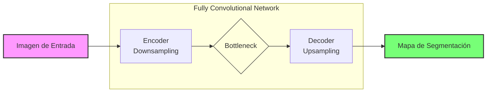
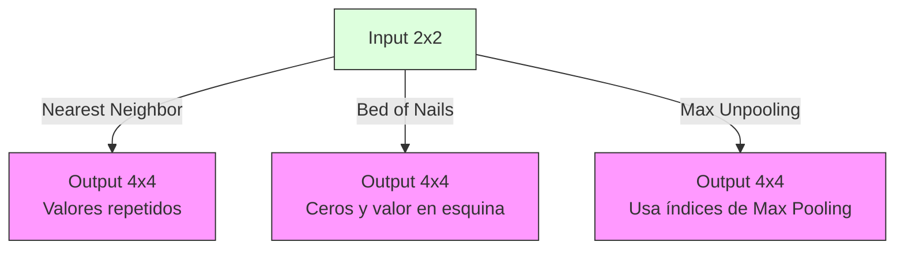
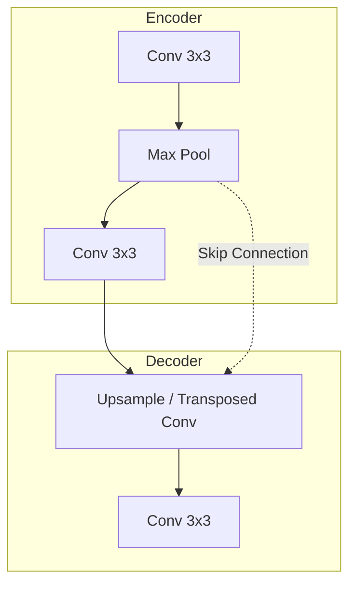

# Segmentación Semántica

## Introducción

La **Segmentación Semántica** es el proceso de clasificar cada píxel de una imagen en una categoría semántica (etiqueta). A diferencia de la clasificación de imágenes tradicional (que asigna una etiqueta a toda la imagen), aquí buscamos una **predicción densa** (*dense prediction*).

*   **Entrada**: Imagen RGB ($3 \times H \times W$).
*   **Salida**: Máscara de segmentación ($H \times W$) donde cada valor representa la clase del píxel.

### El Problema del Contexto
No se puede clasificar un píxel de forma aislada sin su contexto.
*   **Solución ingenua (Patch Classification)**: Extraer un parche (*patch*) alrededor de cada píxel y clasificarlo con una CNN.
    *   *Problema*: Muy ineficiente (muchos cálculos redundantes) y difícil elegir el tamaño del parche.

## Fully Convolutional Networks (FCN)

La solución estándar es utilizar redes **totalmente convolucionales**. Estas redes suelen seguir una arquitectura de **Encoder-Decoder**.

1.  **Downsampling (Encoder)**: Reducción de la resolución espacial mediante *Pooling* o convoluciones con *stride*. Aumenta el campo receptivo y extrae características semánticas ("qué es").
2.  **Upsampling (Decoder)**: Recuperación de la resolución espacial original. Combina información semántica con detalles espaciales ("dónde está").

## Técnicas de Upsampling (Sobremuestreo)

Para recuperar la resolución original en el Decoder, necesitamos operaciones inversas al Pooling o la Convolución.

### 1. Unpooling
Métodos no aprendibles para aumentar el tamaño espacial.

*   **Nearest Neighbor**: Repite el valor del píxel en una vecindad (ej. $2\times2$).
*   **Bed of Nails**: Coloca el valor en una posición fija (ej. esquina superior izquierda) y rellena el resto con ceros.
*   **Max Unpooling**: Utiliza los índices guardados de la capa de *Max Pooling* correspondiente en el Encoder para colocar los valores en sus posiciones originales (donde estaban los máximos).

### 2. Convolución Transpuesta (Transposed Convolution)
También llamada erróneamente "Deconvolution". Es una capa **aprendible** que aumenta la resolución espacial.

Matemáticamente, si una convolución se puede expresar como una multiplicación matricial $C \cdot x$, la convolución transpuesta es $C^T \cdot x$ (multiplicar por la matriz transpuesta), lo que proyecta un espacio de menor dimensión a uno mayor.

> **Nota**: No invierte los valores numéricos de la convolución original (no es la inversa matemática), solo recupera la estructura espacial.

#### Aritmética Básica (Simplificada 1D)
Para un input $x$, kernel $k$ y output $y$:

$$ y = k * x $$ (operación de expansión)

Donde en una convolución transpuesta con *stride* $s$, insertamos $s-1$ ceros entre los valores de entrada antes de convolucionar.

**Leyenda:**
*   $y$: Señal de salida (mayor resolución).
*   $x$: Señal de entrada (menor resolución).
*   $k$: Kernel o filtro (parámetros aprendibles).
*   $s$: Stride (paso), determina cuánto se "estira" la entrada.

### Simetría en FCN
Las arquitecturas suelen ser simétricas: cada reducción de tamaño en el encoder tiene una contraparte de aumento en el decoder.

