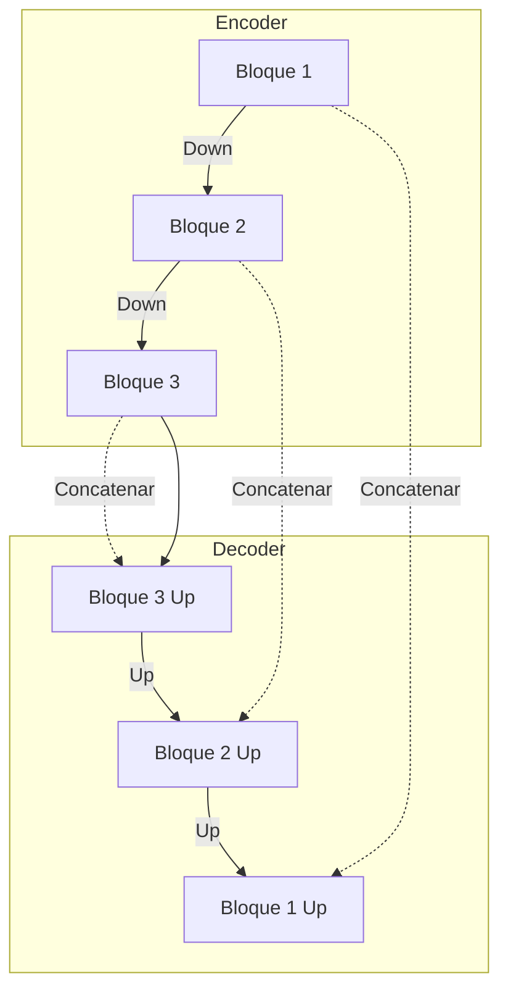

# Arquitecturas y Evaluación de Segmentación

## Arquitecturas Principales

### 1. U-Net
Originalmente diseñada para segmentación biomédica. Es una arquitectura **FCN simétrica** con forma de "U".

*   **Encoder (Contracting Path)**: Captura el contexto. Típica CNN con pooling.
*   **Decoder (Expansive Path)**: Permite una localización precisa.
*   **Skip Connections**: Conexiones grises que copian los mapas de características del encoder directamente al decoder (concatenación).
    *   *Objetivo*: Recuperar detalles finos e información espacial perdida durante el downsampling.

### 2. Autoencoders
Redes entrenadas para copiar su entrada a su salida ($x \approx g(f(x))$).
*   **Denoising Autoencoders**: Se entrena corrompiendo la entrada (ruido) y forzando a la red a recuperar la imagen original limpia.

### 3. DeepLabV3+
Arquitectura estado del arte para segmentación semántica. Introduce dos conceptos clave para manejar múltiples escalas sin perder resolución:

1.  **Convoluciones Atrous (Dilatadas)**: Permiten aumentar el campo receptivo sin reducir la resolución espacial ni aumentar el número de parámetros. Tienen un parámetro `rate` ($r$) que indica la separación entre los valores del kernel.
2.  **ASPP (Atrous Spatial Pyramid Pooling)**: Captura el contexto a múltiples escalas aplicando convoluciones atrous con diferentes tasas en paralelo y concatenando los resultados.

## Keypoint Regression
Localización de puntos clave (ej. articulaciones, rasgos faciales).
*   **Opción 1 (Regresión Directa)**: Predecir coordenadas $(x, y)$. Difícil convergencia.
*   **Opción 2 (Mapas de Calor / Heatmaps)**: Predecir una imagen donde cada píxel tiene la probabilidad de ser el keypoint (gaussiana centrada en el punto). Se usa una pérdida MSE.

## Evaluación y Métricas

### Funciones de Pérdida (Loss Functions)
*   **Pixel-wise Cross Entropy**: La estándar. Softmax por píxel.
*   **Weighted Cross Entropy**: Asigna pesos mayores a las clases minoritarias para combatir el desbalanceo de clases.
*   **Dice Loss / Focal Loss**: Alternativas populares para segmentación desbalanceada.

### Métricas de Rendimiento

#### 1. Dice Similarity Coefficient (DSC) o F1-Score
Mide el solapamiento entre la predicción y la verdad terreno (*ground truth*).

$$ DSC = \frac{2|X \cap Y|}{|X| + |Y|} = \frac{2TP}{2TP + FP + FN} $$

**Leyenda:**
*   $X$: Conjunto de píxeles predichos (segmentación).
*   $Y$: Conjunto de píxeles reales (ground truth).
*   $| \cdot |$: Cardinalidad (número de píxeles).
*   $\cap$: Intersección (píxeles comunes).
*   $TP$: Verdaderos Positivos.
*   $FP$: Falsos Positivos.
*   $FN$: Falsos Negativos.

#### 2. Intersection over Union (IoU) o Jaccard Index
La métrica más estándar. Penaliza más los errores que el Dice.

$$ IoU = J(X,Y) = \frac{|X \cap Y|}{|X \cup Y|} $$

Relación con Dice: $IoU = \frac{DSC}{2 - DSC}$

**Leyenda:**
*   $\cup$: Unión de los conjuntos de píxeles $X$ e $Y$.

#### 3. Distancia de Hausdorff (HD)
Mide la precisión de los contornos (bordes). Es la distancia máxima desde un punto en un conjunto al punto más cercano en el otro conjunto.

$$ HD(X,Y) = \max(h(X,Y), h(Y,X)) $$
$$ h(X,Y) = \sup_{x \in X} \inf_{y \in Y} d(x,y) $$

**Leyenda:**
*   $d(x,y)$: Distancia euclídea entre los puntos $x$ e $y$.
*   $\sup$: Supremo (máximo).
*   $\inf$: Ínfimo (mínimo).
*   *Interpretación*: El "peor" error de distancia entre los bordes de la predicción y la realidad.
