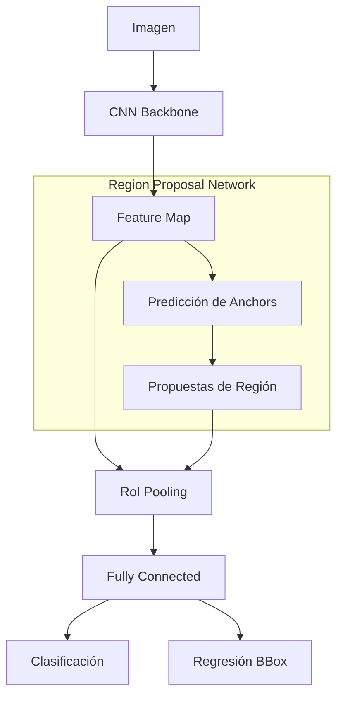

# Detección de Objetos: Fundamentos y Familia R-CNN

## Definiciones

Diferencias clave entre tareas de visión:

| Tarea | Salida | ¿Múltiples Objetos? |
| :--- | :--- | :--- |
| **Clasificación** | Una etiqueta (Clase) | No (generalmente) |
| **Detección de Objetos** | Bounding Box $(x, y, w, h)$ + Clase | Sí |
| **Segmentación Semántica** | Máscara de píxeles | Sí (pero no distingue instancias) |
| **Segmentación de Instancia** | Máscara + Distinción de instancias | Sí |

## Evolución de Métodos

### 1. Sliding Window (Ventana Deslizante)
Enfoque clásico. Se desliza una ventana de diferentes tamaños por toda la imagen y se clasifica el contenido.
*   **Problema**: Extremadamente costoso computacionalmente. Requiere miles de evaluaciones por imagen.

### 2. R-CNN (Region-based CNN)
Primer gran éxito usando Deep Learning.
1.  **Region Proposals**: Usa algoritmos clásicos (ej. *Selective Search*) para proponer ~2000 regiones candidatas ("blobs").
2.  **Warp**: Redimensiona cada región a un tamaño fijo (ej. 224x224).
3.  **ConvNet**: Pasa **cada** región independientemente por una CNN (ej. AlexNet).
4.  **Clasificación + Regresión**: SVM para clasificar y Regresión lineal para ajustar la caja ($dx, dy, dw, dh$).

*   **Problema**: Lento (~2k pasadas por la CNN). No es *end-to-end*.

### 3. Fast R-CNN
Mejora de velocidad drástica.
1.  **Backbone compartida**: Pasa **toda la imagen** por la CNN una sola vez para obtener un mapa de características (*feature map*).
2.  **RoI Pooling**: Proyecta las propuestas de regiones (de Selective Search) sobre el mapa de características y extrae tensores de tamaño fijo.
3.  **Cabeceras**: Capas *Fully Connected* para clasificar y regresar la caja.

*   **Ventaja**: Comparte cómputo de la CNN.
*   **Problema**: Sigue dependiendo de *Selective Search* (lento y externo a la GPU) para generar las propuestas.

### 4. Faster R-CNN
Introduce la **Region Proposal Network (RPN)** para hacer el sistema totalmente *end-to-end*.

*   **RPN**: Una pequeña red neuronal que se desliza sobre el mapa de características y predice si hay un objeto y ajusta cajas base llamadas **Anchors**.
    *   **Anchors**: Cajas predefinidas de diferentes escalas y relaciones de aspecto en cada posición.
*   **Arquitectura**:
    1.  Backbone CNN.
    2.  RPN (genera propuestas).
    3.  RoI Pooling (usa las propuestas de la RPN).
    4.  Clasificación y Regresión final.

## Resumen Evolutivo

1.  **R-CNN**: CNN por región (Lento).
2.  **Fast R-CNN**: CNN compartida + RoI Pooling (Cuello de botella en propuestas).
3.  **Faster R-CNN**: CNN compartida + RPN (Tiempo real, todo en GPU).
