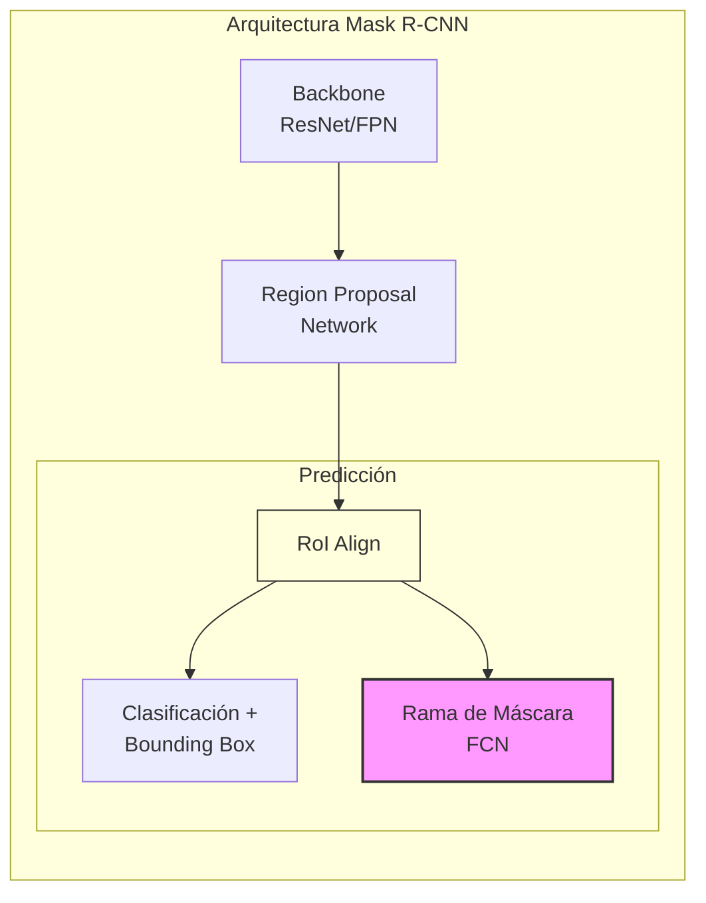

# Detección Avanzada y Evaluación

## Detectores de Una Etapa (Single-Stage)

A diferencia de Faster R-CNN (Two-Stage: Propuestas + Clasificación), estos modelos hacen todo en un solo paso. Son más rápidos pero históricamente un poco menos precisos.

### YOLO (You Only Look Once) / SSD (Single Shot Detector)
Dividen la imagen en una rejilla (grid) de $S \times S$.
*   En cada celda, la red predice directamente:
    *   $B$ Cajas delimitadoras (offsets respecto a *anchors*).
    *   Puntuación de confianza.
    *   Probabilidades de clase ($C$). 
*   **Salida**: Tensor de $S \times S \times (5 \cdot B + C)$.

> "Parece una RPN pero específica para categorías finales y sin segunda etapa de refinamiento."

## Segmentación de Instancia: Mask R-CNN
Extensión de Faster R-CNN para realizar segmentación de instancia (detectar objetos y marcar sus píxeles exactos, diferenciando entre objetos de la misma clase).

*   **Arquitectura**: Faster R-CNN + Rama de Máscara.
    *   Añade una tercera rama paralela a la clasificación y regresión de caja.
    *   Esta rama es una pequeña FCN que predice una máscara binaria para cada Región de Interés (RoI).
*   **RoI Align**: Mejora del *RoI Pooling* estándar para evitar errores de cuantización (desalineamientos) que afectan a la precisión de la máscara a nivel de píxel.

## Evaluación en Detección

### 1. Intersection over Union (IoU)
Criterio para decidir si una detección es correcta (True Positive).
*   Se compara la caja predicha con la caja real (*Ground Truth*).
*   Umbral común: $IoU > 0.5$.

### 2. Non-Maxima Suppression (NMS)
Los detectores suelen generar múltiples cajas solapadas para el mismo objeto. NMS limpia esto.
**Algoritmo**:
1.  Descartar cajas con confianza baja (ej. $< 0.6$).
2.  Seleccionar la caja con mayor confianza ($A$). 
3.  Calcular IoU de $A$ con el resto de cajas.
4.  Eliminar las que tengan un solapamiento alto (ej. $IoU > 0.5$) con $A$ (asumiendo que son duplicados del mismo objeto).
5.  Repetir hasta que no queden cajas.

### 3. Mean Average Precision (mAP)
La métrica estándar para comparar detectores.

1.  **Precision-Recall Curve**: Para cada clase, se calcula la curva variando el umbral de confianza de las detecciones.
    *   **Precision**: $\frac{TP}{TP + FP}$ (¿Cuántas de mis detecciones son reales?)
    *   **Recall**: $\frac{TP}{TP + FN}$ (¿Cuántos objetos reales he encontrado?)
2.  **Average Precision (AP)**: El área bajo la curva Precision-Recall para una clase específica.
    $$ AP = \int_0^1 p(r) dr $$
    *Leyenda*: $p(r)$ es la precisión en función del recall $r$.
3.  **mAP**: La media (*mean*) de los AP de todas las clases ($C$).
    $$ mAP = \frac{1}{C} \sum_{i=1}^{C} AP_i $$

> Un buen detector mantiene una precisión alta incluso cuando el recall aumenta (encuentra todos los objetos sin cometer muchos errores falsos positivos).
