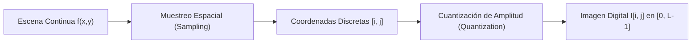
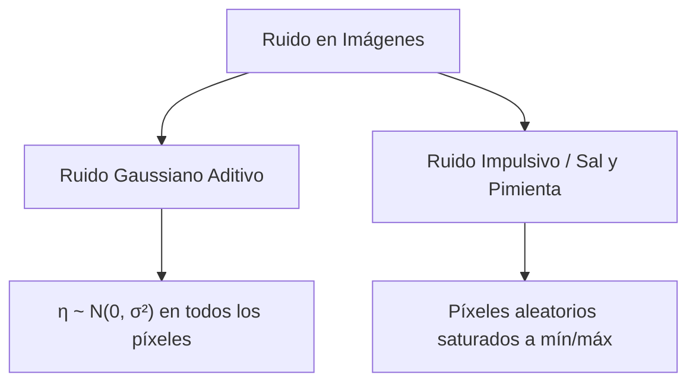
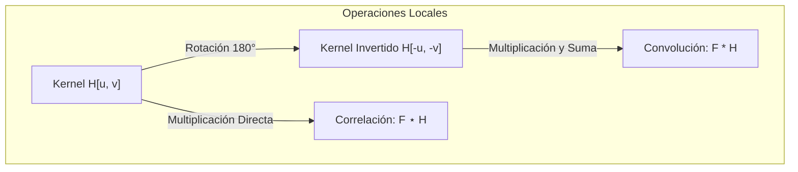
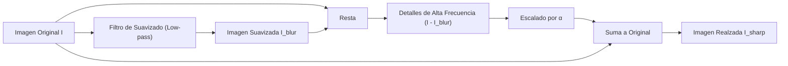
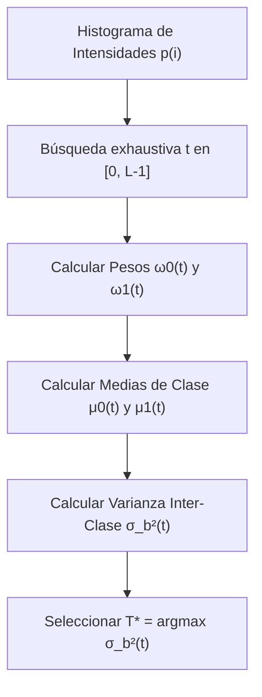
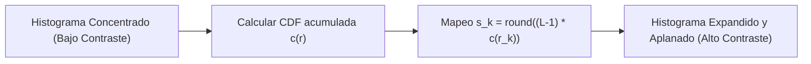

# 1. Representación de Imágenes y Filtrado Lineal

Este documento aborda la formalización matemática del concepto de imagen digital, los sistemas de coordenadas e indexación en programación científica, los modelos estadísticos de ruido, los fundamentos algebraicos de la convolución y la correlación cruzada en sistemas lineales invariantes al desplazamiento (LSI), las estrategias de gestión de bordes, el realce de imagen mediante *Unsharp Masking*, y los operadores no lineales y globales de segmentación y contraste (Filtro de Mediana, Algoritmo de Otsu y Ecualización de Histograma).

---

## 1. Fundamentos de la Imagen Digital

Una escena visual continua se proyecta ópticamente sobre un sensor fotosensible (CCD o CMOS), transformando el flujo fotónico incidente en una función bidimensional de irradiancia continua:
$$ f: \mathbb{R}^2 \longrightarrow [0, \infty) $$

Para procesar esta información en un computador digital, es obligatorio aplicar dos procesos de discretización:



1. **Muestreo Espacial (*Sampling*):** Discretización periódica del dominio continuo $(x,y)$ mediante una retícula de sensores de paso $\Delta x, \Delta y$. Cada elemento unitario de la retícula resultante constituye un **píxel** (*picture element*).
2. **Cuantización de Amplitud (*Quantization*):** Mapeo de la irradiancia lumínica continua (infinita en precisión) a un conjunto finito y discreto de $L$ niveles de gris o color. Si se emplean $b$ bits por píxel (*bit depth*), el rango dinámico contiene:
   $$ L = 2^b \quad \text{niveles de intensidad (típicamente } b=8 \implies [0, 255]\text{)} $$

---

## 2. Sistemas de Coordenadas e Indexación en Python/NumPy

Uno de los errores más frecuentes en visión por computador proviene de confundir el **sistema de coordenadas cartesiano geométrico** con la **indexación matricial en memoria**:

```text
    (x=0, y=0) ─────── Coordenada X (Columnas, Ancho W) ───────>
        │      (columna 0)      (columna 1)     ...     (columna W-1)
        │    ┌───────────────┬───────────────┬───────┬───────────────┐
  Coordenada │ Fila 0        │               │       │               │
      Y      ├───────────────┼───────────────┼───────┼───────────────┤
  (Filas,    │ Fila 1        │               │       │               │
   Alto H)   ├───────────────┼───────────────┼───────┼───────────────┤
        │    │ ...           │               │       │               │
        │    ├───────────────┼───────────────┼───────┼───────────────┤
        v    │ Fila H-1      │               │       │  I[H-1, W-1]  │
             └───────────────┴───────────────┴───────┴───────────────┘
```

> [!info] Comparación de Notaciones
> - **Geométrica / Matemática:** $(x, y)$, donde $x$ es el desplazamiento horizontal hacia la derecha e $y$ es el desplazamiento vertical (habitualmente hacia abajo en computación gráfica).
> - **Matricial en NumPy:** `img[fila, columna]` $\equiv$ `img[y, x]`. El primer eje representa el eje vertical (alto $H$) y el segundo el horizontal (ancho $W$).

### Imágenes en Color y Canales
Una imagen digital en color se modela matemáticamente como un campo vectorial bidimensional:
$$ \mathbf{I}: \mathbb{Z}^2 \longrightarrow \mathbb{R}^C $$
donde $C=3$ para el espacio RGB.

En NumPy, las matrices se ordenan según el esquema de filas contiguas (*row-major order*):
```python
# img.shape -> (Height, Width, Channels) = (H, W, 3)
pixel_rojo = img[y, x, 0]    # Canal R (Red)
pixel_verde = img[y, x, 1]   # Canal G (Green)
pixel_azul = img[y, x, 2]    # Canal B (Blue)
```

> [!tip] Conversión Estándar a Escala de Grises (Luminancia)
> La visión humana no percibe todos los colores con la misma sensibilidad espectral (la fóvea contiene una mayor densidad de conos sensibles al verde). Por ello, la conversión a escala de grises no es un promedio simple, sino una combinación lineal ponderada basada en el estándar ITU-R BT.601:
> $$ Y = 0.2989 \, R + 0.5870 \, G + 0.1140 \, B $$
>
> > [!info] Leyenda Matemática
> > - $Y$: Valor de luminancia escalar monocromática resultante.
> > - $R, G, B$: Valores de intensidad de los canales rojo, verde y azul respectivamente.

---

## 3. Modelos de Ruido en Imágenes

Durante la captura, amplificación y conversión analógico-digital en el sensor, se incorporan perturbaciones estocásticas denominadas **ruido**. Los modelos canónicos más relevantes en visión por computador son:



### A. Ruido Gaussiano Aditivo
Es la consecuencia del ruido térmico y las fluctuaciones cuánticas de fotones en los fotodiodos del sensor (*photon shot noise*). Se modela como una variable aleatoria continua sumada a la señal pura:
$$ I(x, y) = f(x, y) + \eta(x, y), \quad \eta \sim \mathcal{N}(0, \sigma^2) $$

> [!info] Leyenda Matemática
> - $I(x, y)$: Señal ruidosa observada en la imagen.
> - $f(x, y)$: Señal ideal subyacente de la escena.
> - $\eta(x, y)$: Variable aleatoria independiente e idénticamente distribuida (i.i.d.) con media nula y varianza $\sigma^2$.

### B. Ruido Sal y Pimienta (*Salt & Pepper*)
Afecta a un subconjunto disperso de píxeles debido a errores puntuales de transmisión o fotodiodos defectuosos en la matriz del sensor:
$$ I(x, y) = \begin{cases} 0 \quad (\text{pimienta / negro}) & \text{con probabilidad } p/2 \\ 255 \quad (\text{sal / blanco}) & \text{con probabilidad } p/2 \\ f(x, y) & \text{con probabilidad } 1 - p \end{cases} $$

---

## 4. Filtrado Lineal: Correlación Cruzada vs. Convolución

El filtrado lineal es un operador de vecindad que reemplaza el valor de cada píxel por una combinación lineal ponderada de las intensidades de sus vecinos, definida por una matriz de pesos denominada **máscara**, **filtro** o **kernel**.

### Correlación Cruzada ($G = F \star H$)
Consiste en el producto escalar deslizante entre el kernel $H$ y el parche de la imagen centrado en $(i, j)$:

$$ G[i, j] = (F \star H)[i, j] = \sum_{u=-k}^k \sum_{v=-k}^k F[i+u, j+v] \, H[u, v] $$

> [!info] Leyenda Matemática
> - $G[i, j]$: Píxel resultante de la correlación en la fila $i$, columna $j$.
> - $F$: Imagen de entrada.
> - $H$: Kernel de dimensiones $(2k+1) \times (2k+1)$, con índices locales $u, v \in [-k, k]$.

### Convolución Bidimensional ($G = F * H$)
La convolución es idéntica a la correlación, con la diferencia fundamental de que **el kernel se invierte espacialmente (se rota 180°)** antes de realizar la suma ponderada:

$$ G[i, j] = (F * H)[i, j] = \sum_{u=-k}^k \sum_{v=-k}^k F[i-u, j-v] \, H[u, v] $$

Equivalentemente, por sustitución de variables:
$$ (F * H)[i, j] = \sum_{u=-k}^k \sum_{v=-k}^k F[i+u, j+v] \, H[-u, -v] $$



### ¿Por qué rotar 180° el kernel?
La inversión del kernel dota a la convolución de propiedades algebraicas fundamentales que la correlación **no** posee:

| Propiedad | Convolución ($F * H$) | Correlación ($F \star H$) | Relevancia Teórica |
| :--- | :---: | :---: | :--- |
| **Conmutativa** | $f * g = g * f$ | $f \star g \ne g \star f$ | Permite intercambiar el rol de imagen y filtro. |
| **Asociativa** | $f * (g * h) = (f * g) * h$ | $f \star (g \star h) \ne (f \star g) \star h$ | **Permite precalcular filtros compuestos complejos.** |
| **Distributiva** | $f * (g + h) = f * g + f * h$ | $f \star (g + h) = f \star g + f \star h$ | Permite descomponer filtros aditivamente. |
| **Simetría Central** | Si $H[u, v] = H[-u, -v]$ | $F \star H = F * H$ | Coinciden en filtros con simetría par (ej. Gaussianas). |

> [!warning] La Correlación no es Conmutativa ni Asociativa
> En la correlación cruzada, si la imagen o el filtro se desplazan, el resultado se mueve en direcciones contrarias ($f \star g \ne g \star f$). Se utiliza casi exclusivamente para *Template Matching* (búsqueda de patrones por correlación normalizada), mientras que la convolución es el pilar de los sistemas de procesado de señales y redes neuronales.

---

## 5. Condiciones de Contorno (*Boundary Issues*) y Relleno (*Padding*)

Cuando el kernel de tamaño $(2k+1) \times (2k+1)$ se sitúa sobre un píxel próximo al borde de la imagen, parte de su soporte espacial cae fuera de los límites de la matriz.

### Modos de Salida según Soporte
Dada una imagen $F$ de dimensiones $H \times W$ y un filtro de tamaño $K_h \times K_w$:
1. **Valid:** El kernel solo se evalúa en posiciones donde cabe completamente sin sobresalir.
   $$\text{Dimensiones: } (H - K_h + 1) \times (W - K_w + 1)$$
2. **Same:** La imagen resultante preserva exactamente las dimensiones originales $H \times W$. Requiere añadir un marco de padding $p = \lfloor K/2 \rfloor$.
3. **Full:** Se evalúa en cualquier posición donde haya al menos 1 píxel de solapamiento entre kernel e imagen.
   $$\text{Dimensiones: } (H + K_h - 1) \times (W + K_w - 1)$$

```text
                      Modos de Convolución
  ┌───────────────────────────────┐
  │         FULL                  │
  │   ┌───────────────────────┐   │
  │   │     SAME              │   │
  │   │   ┌───────────────┐   │   │
  │   │   │    VALID      │   │   │
  │   │   │ (Sin padding) │   │   │
  │   │   └───────────────┘   │   │
  │   └───────────────────────┘   │
  └───────────────────────────────┘
```

### Estrategias de Relleno (*Padding*)
- **Zero-Padding (Clip):** Rellenar con ceros (negro). Simple pero genera un marcado borde negro artificial que distorsiona las derivadas.
- **Replicate (Clamp):** Repetir el valor del píxel del borde más cercano (`... a a | a b c d | d d ...`).
- **Reflect (Symmetric):** Reflejar la señal como en un espejo (`... c b a | a b c d | d c b ...`). Minimiza las discontinuidades artificiales de gradiente.
- **Wrap (Toroidal):** Conectar el borde derecho con el izquierdo y el inferior con el superior (`... c d | a b c d | a b ...`). Coincide con la suposición de periodicidad de la Transformada Discreta de Fourier (DFT).

---

## 6. Propiedades de los Sistemas Lineales e Invariantes al Desplazamiento (LSI)

Un operador de filtrado $\mathcal{L}$ es un **sistema LSI** (*Linear and Shift-Invariant*) si satisface dos axiomas:
1. **Linealidad (Superposición y Homogeneidad):**
   $$ \mathcal{L}(\alpha f + \beta g) = \alpha \mathcal{L}(f) + \beta \mathcal{L}(g), \quad \forall \alpha, \beta \in \mathbb{R} $$
2. **Invarianza al Desplazamiento (*Shift-Invariance*):**
   $$ \text{Si } \mathcal{L}(f(x, y)) = g(x, y) \implies \mathcal{L}(f(x - x_0, y - y_0)) = g(x - x_0, y - y_0) $$

> [!important] Teorema de Representación de Sistemas LSI
> Todo sistema lineal e invariante al desplazamiento queda **unívocamente determinado** por su respuesta al impulso unitario (Delta de Kronecker $\delta[i, j]$). La salida ante cualquier entrada $F$ es formalmente la **convolución** de $F$ con dicha respuesta al impulso $H$:
> $$ G = F * H $$

---

## 7. Catálogo de Filtros Lineales Básicos

### A. Filtro Identidad
Deja la imagen inalterada:
$$ H_{id} = \begin{bmatrix} 0 & 0 & 0 \\ 0 & 1 & 0 \\ 0 & 0 & 0 \end{bmatrix} $$

### B. Filtro de Desplazamiento (*Shift*)
Traslada la imagen 1 píxel hacia la izquierda (recordar la inversión de 180° de la convolución):
$$ H_{shift} = \begin{bmatrix} 0 & 0 & 0 \\ 0 & 0 & 1 \\ 0 & 0 & 0 \end{bmatrix} $$

### C. Filtro de Media (*Box Filter* / *Moving Average*)
Calcula el promedio aritmético de las intensidades en una ventana local $K \times K$:
$$ H_{box} = \frac{1}{K^2} \begin{bmatrix} 1 & 1 & \dots & 1 \\ 1 & 1 & \dots & 1 \\ \vdots & \vdots & \ddots & \vdots \\ 1 & 1 & \dots & 1 \end{bmatrix} $$

> [!info] Leyenda Matemática
> - $\frac{1}{K^2}$: Factor de escala que garantiza **ganancia DC unitaria** ($\sum H[u, v] = 1$). Esto asegura que el brillo promedio global de una zona homogénea permanece inalterado.

---

## 8. Realce de Imágenes: *Unsharp Masking*

El *Unsharp Masking* (máscara de desenfoque) es una técnica clásica procedente de la fotografía analógica para aumentar la nitidez aparente de una imagen resaltando sus altas frecuencias (bordes y transiciones rápidas).



### Formulación Matemática
1. Se extraen los detalles de alta frecuencia restando una versión suavizada $I_{blur}$ a la imagen original $I$:
   $$ \text{Detalles} = I - I_{blur} $$
2. Se reincorporan estos detalles amplificados por un factor de realce $\alpha > 0$:
   $$ I_{sharp} = I + \alpha (I - I_{blur}) $$

> [!info] Leyenda Matemática
> - $I$: Imagen original de entrada.
> - $I_{blur}$: Imagen tras la aplicación de un filtro paso-baja (box filter o gaussiano).
> - $\alpha$: Factor de amplificación del contraste de alta frecuencia ($\alpha \in [0.2, 1.5]$ típicamente).

### Kernel Equivalente de Convolución Única
Gracias a la propiedad distributiva y asociativa de la convolución, si $I_{blur} = I * H_{blur}$, podemos expresar toda la operación como una **única convolución**:

$$ I_{sharp} = I * \delta + \alpha (I * \delta - I * H_{blur}) = I * \left[ (1 + \alpha)\delta - \alpha H_{blur} \right] $$

> [!example] Deducción para un Box Filter $3\times 3$ con $\alpha = 1$
> $$ H_{sharp} = 2 \begin{bmatrix} 0 & 0 & 0 \\ 0 & 1 & 0 \\ 0 & 0 & 0 \end{bmatrix} - \frac{1}{9} \begin{bmatrix} 1 & 1 & 1 \\ 1 & 1 & 1 \\ 1 & 1 & 1 \end{bmatrix} = \frac{1}{9} \begin{bmatrix} -1 & -1 & -1 \\ -1 & 17 & -1 \\ -1 & -1 & -1 \end{bmatrix} $$
> Observa que la suma de todos los coeficientes del kernel sigue siendo $\frac{-8 + 17}{9} = 1$, preservando la ganancia DC unitaria.

---

## 9. Operadores No Lineales y Globales

### A. Filtro de Mediana (*Median Filter*)
Los filtros lineales promedian los valores de la vecindad. Ante un píxel de sal o pimienta (por ejemplo, valor $255$), ese valor extremo contamina la media de toda la vecindad, difuminando el defecto pero esparciéndolo.

El **filtro de mediana** es un operador no lineal que ordena las intensidades de la vecindad $W$ y selecciona el elemento central:
$$ I_{out}[i, j] = \text{mediana} \left( \{ I[i+u, j+v] \mid (u, v) \in W \} \right) $$

```text
Vecindad 3x3 ruidosa:          Valores ordenados:
┌─────┬─────┬─────┐
│ 100 │ 102 │ 101 │            [98, 99, 100, 101, 101, 102, 103, 104, 255]
├─────┼─────┼─────┤                                    ▲
│  99 │ 255 │ 103 │                                    │
├─────┼─────┼─────┤                              Mediana = 101
│  98 │ 101 │ 104 │
└─────┴─────┴─────┘            El valor aberrante 255 queda completamente descartado.
```

> [!tip] Ventajas del Filtro de Mediana
> 1. **Robustez estadística absoluta:** Elimina al 100% los valores de sal y pimienta mientras no ocupen más del 50% de la ventana local.
> 2. **Preservación de bordes:** A diferencia de la media, una transición abrupta paso-escalón (*step edge*) no se suaviza ni se redondea, pues la mediana toma valores reales observados en la muestra.

---

### B. Umbralizado Global y Método de Otsu

La umbralización convierte una imagen en escala de grises en una máscara binaria separando el objeto (*foreground*) del fondo (*background*):
$$ g(x, y) = \begin{cases} 1 & \text{si } I(x, y) \ge T \\ 0 & \text{si } I(x, y) < T \end{cases} $$

#### Algoritmo Óptimo de Otsu (1979)
El método de Nobuyuki Otsu calcula analíticamente el umbral global óptimo $T^*$ a partir del histograma normalizado de la imagen $p(i) = n_i / N$, sin necesidad de supervisión. 



El algoritmo modela el histograma como una mezcla bimodal y encuentra el umbral que **maximiza la varianza inter-clase $\sigma_b^2(t)$** (o equivalentemente, **minimiza la varianza intra-clase $\sigma_w^2(t)$**):

1. **Probabilidades acumuladas de cada clase (pesos):**
   $$ \omega_0(t) = \sum_{i=0}^t p(i), \quad \omega_1(t) = \sum_{i=t+1}^{L-1} p(i) = 1 - \omega_0(t) $$
2. **Medias de cada clase:**
   $$ \mu_0(t) = \sum_{i=0}^t \frac{i \cdot p(i)}{\omega_0(t)}, \quad \mu_1(t) = \sum_{i=t+1}^{L-1} \frac{i \cdot p(i)}{\omega_1(t)} $$
3. **Varianza Inter-Clase $\sigma_b^2(t)$:**
   $$ \sigma_b^2(t) = \omega_0(t) \, \omega_1(t) \, \left[ \mu_0(t) - \mu_1(t) \right]^2 $$

> [!important] Criterio de Selección de Otsu
> El umbral óptimo global es aquel que maximiza la separación estadística entre las medias de ambas poblaciones:
> $$ T^* = \arg\max_{0 \le t < L-1} \sigma_b^2(t) $$

---

### C. Ecualización del Histograma

En imágenes con bajo contraste (debido a mala iluminación o rango dinámico deficiente), las intensidades se concentran en una banda estrecha del espectro disponible. La **ecualización de histograma** busca una función de transformación monótona creciente $s = T(r)$ que distribuya uniformemente los niveles de intensidad en todo el rango $[0, L-1]$.



### Formulación Matemática Discreta
1. Se calcula la **función de distribución acumulada normalizada** (*CDF*):
   $$ c(r_k) = \sum_{j=0}^k p_r(r_j) = \sum_{j=0}^k \frac{n_j}{N} $$
2. Se remapea cada intensidad original $r_k$ mediante la transformación:
   $$ s_k = T(r_k) = \text{round}\left( (L - 1) \cdot c(r_k) \right) $$

> [!info] Leyenda Matemática
> - $r_k$: Nivel de gris original de entrada ($r_k \in [0, L-1]$).
> - $s_k$: Nuevo nivel de gris asignado al píxel en la imagen de salida.
> - $p_r(r_j)$: Probabilidad empírica del nivel de gris $j$ ($n_j$ píxeles entre el total de píxeles $N$).
> - $L$: Número total de niveles de gris posibles (habitualmente $256$).

---

## 10. Conexión Conceptual con el Temario

- **Siguiente paso:** En [[2. Gaussianas y Bordes]], exploraremos en profundidad el suavizado gaussiano analítico, la descomposición de filtros derivados (Sobel, Prewitt, Scharr), y el detector de bordes de Canny.
- **Dominio transformado:** En [[3. Analisis de Frecuencia]], veremos cómo la convolución espacial equivale a una multiplicación directa en el dominio de Fourier mediante el Teorema de la Convolución.
- **Multirresolución:** En [[4. Piramides y Escala]], construiremos pirámides para análisis multiescala y fusión de imágenes sin artefactos.
- **Práctica de Examen:** En [[5. Ejercicios y Preguntas de Examen]], encontrarás preguntas tipo test y problemas numéricos resueltos paso a paso sobre estos conceptos.

---

### 📚 Referencias Bibliográficas

- **Szeliski, Richard** (2022). *Computer Vision: Algorithms and Applications* (2nd ed.). Springer.
  - **Capítulo / Sección:** Chapter 3: Image processing $\to$ Section 3.1: *Point operators* y Section 3.2: *Linear filtering*.
  - **Archivo local:** [[docs_clase/textBook/Szeliski/Chapter_3_Image_processing/3.1_Point_operators.md|Szeliski - Chapter 3.1 Point operators]] y [[docs_clase/textBook/Szeliski/Chapter_3_Image_processing/3.2_Linear_filtering.md|Section 3.2 Linear filtering]].
- **Forsyth, David A.; Ponce, Jean** (2012). *Computer Vision: A Modern Approach* (2nd ed.). Pearson.
  - **Capítulo / Sección:** Chapter 4: Linear Filters $\to$ Section 4.1: *Linear Filters and Convolution*.
  - **Archivo local:** [[docs_clase/textBook/Forsyth_Ponce/4_Linear_Filters/4.1_Linear_Filters_and_Convolution.md|Forsyth & Ponce - Chapter 4.1 Linear Filters and Convolution]].
- **Torralba, Antonio; Isola, Phillip; Freeman, William T.** (2024). *Foundations of Computer Vision*. MIT Press.
  - **Capítulo / Sección:** Linear Image Filtering $\to$ *Cross-Correlation Versus Convolution*.
  - **Archivo local:** [[docs_clase/textBook/Torralba_Foundations/linear_image_filtering.md|Torralba - Linear Image Filtering]].
- **Otsu, Nobuyuki** (1979). *A threshold selection method from gray-level histograms*. IEEE Transactions on Systems, Man, and Cybernetics, 9(1), 62-66.
