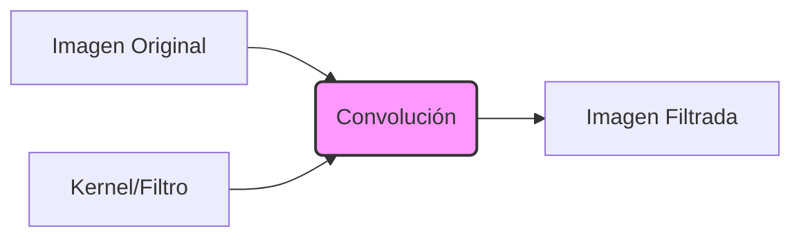

# 1. Representación de Imágenes y Filtrado Lineal

## Definición de Imagen Digital
Una imagen digital es una **discretización** de una función continua $f(x,y)$ que representa la intensidad de la luz en una posición espacial.
- **Muestreo (Sampling):** Discretización de las coordenadas espaciales (píxeles).
- **Cuantización:** Discretización de los valores de amplitud (intensidad, ej: 0-255).

## Ruido en Imágenes
Las imágenes reales siempre contienen ruido (información no deseada).
- **Sal y Pimienta:** Píxeles aleatorios blancos y negros (afecta a máximos y mínimos).
- **Ruido Impulsivo:** Píxeles blancos aleatorios.
- **Ruido Gaussiano:** Variaciones de intensidad que siguen una distribución normal.

---

## Filtrado Lineal
Operación local donde se reemplaza el valor de un píxel por una **combinación lineal** de sus vecinos. Se utiliza un **Kernel** (máscara o filtro).

### Correlación Cruzada vs. Convolución
Son operaciones similares, pero con una diferencia matemática crucial para propiedades como la conmutatividad.

1.  **Correlación Cruzada ($G = H \otimes F$):** "Producto punto" deslizante. Se usa para *template matching* (buscar un patrón).
2.  **Convolución ($G = H * F$):** Igual que la correlación, pero el kernel se **invierte** (rota 180°) antes de operar. Se usa para filtrar.

$$ G[i, j] = \sum_{u=-k}^{k} \sum_{v=-k}^{k} H[u, v] F[i-u, j-v] $$

> [!info] Leyenda Matemática
> *   $G[i,j]$: Píxel de la imagen de salida en posición $(i,j)$.
> *   $H$: Kernel o filtro de tamaño $(2k+1) \times (2k+1)$.
> *   $F$: Imagen de entrada.
> *   $u, v$: Índices locales del kernel.

### Propiedades de la Convolución
*   **Linealidad:** $L(af + bg) = aL(f) + bL(g)$.
*   **Invarianza al desplazamiento:** El operador se comporta igual en toda la imagen.
*   **Conmutativa:** $f * g = g * f$.
*   **Asociativa:** $f * (g * h) = (f * g) * h$. (Permite combinar filtros).

## Problemas de Borde (Boundary Issues)
Al aplicar un filtro en los bordes, el kernel "se sale" de la imagen. Soluciones comunes (Padding):
*   **Clip (Zero-padding):** Rellenar con negro (0).
*   **Wrap:** Envolver la imagen (tipo toroide).
*   **Copy/Replicate:** Repetir el píxel del borde.
*   **Reflect:** Reflejar la imagen como un espejo.

---

## Filtros No Lineales
No usan sumas ponderadas.
*   **Filtro de Mediana:** Reemplaza el píxel por la mediana de sus vecinos.
    *   *Uso:* Excelente para eliminar **ruido de sal y pimienta** sin difuminar los bordes tanto como la media.

