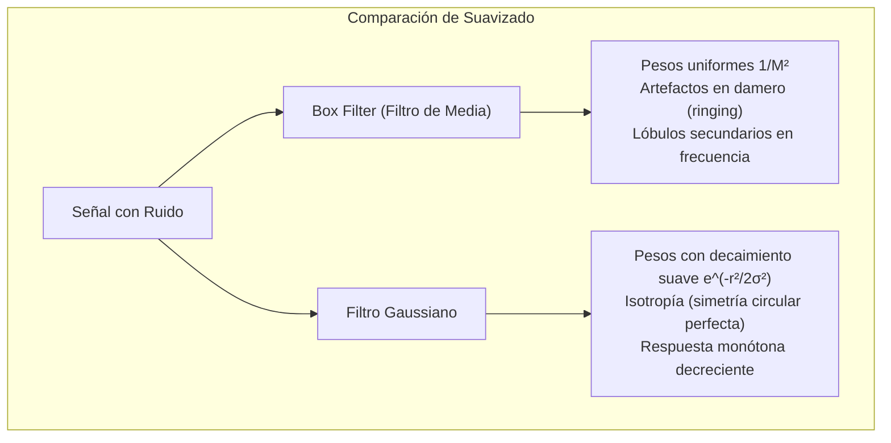
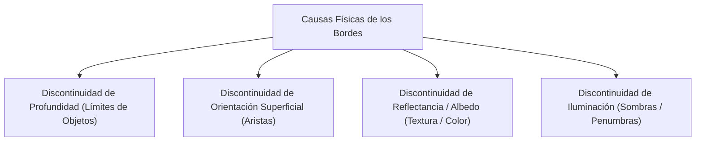
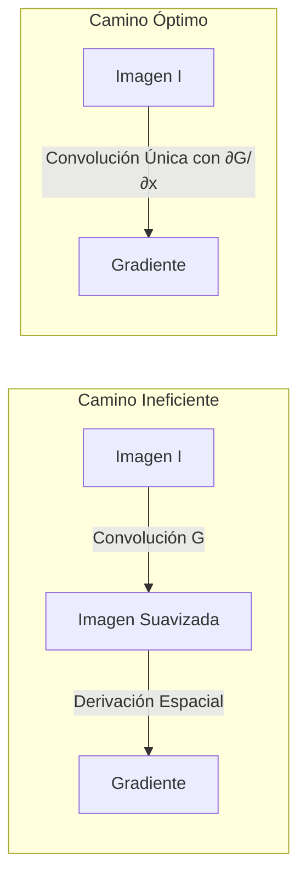
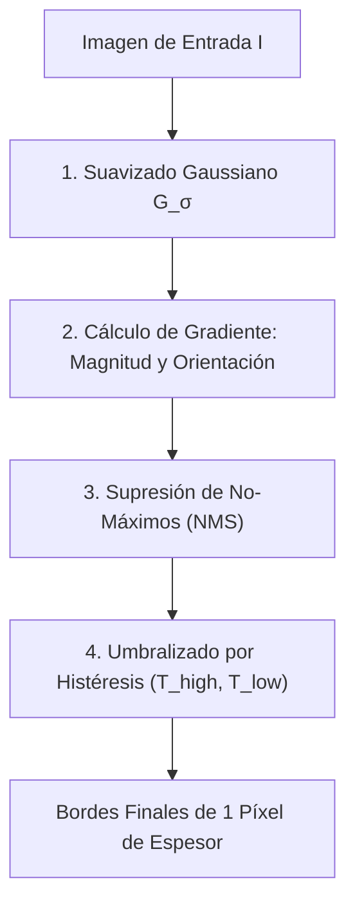
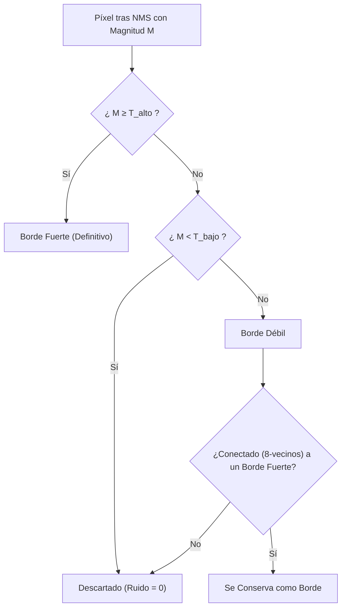

# 2. Filtros Gaussianos y Detección de Bordes

Este documento formaliza el núcleo analítico de la visión clásica para el análisis de bordes y escalas: la comparación entre filtros de media y filtros gaussianos, las propiedades algebraicas de la función gaussiana (separabilidad, semigrupo y convolución en cascada), la física y matemáticas de los bordes, los operadores de gradiente de primer y segundo orden (Sobel, Scharr, Laplaciana y DoG) y el algoritmo canónico de detección de bordes de John Canny.

---

## 1. Suavizado: Box Filter frente a Filtro Gaussiano

El suavizado espacial es un proceso paso-baja (*low-pass*) diseñado para atenuar las altas frecuencias asociadas al ruido estocástico del sensor.



### Problemas del Box Filter (Filtro de Media)
1. **Falta de Isotropía:** El soporte cuadrado de la ventana asigna el mismo peso a píxeles lejanos en las esquinas que a los píxeles más cercanos en los ejes principales, introduciendo bordes artificiales rectilíneos (*grid artifacts*).
2. **Oscilaciones Espurias (*Ringing*):** En el dominio de Fourier, la transformada de un pulso cuadrado espacial es una función $\text{sinc}(\omega) = \frac{\sin(\pi \omega)}{\pi \omega}$, la cual presenta lóbulos laterales considerables con signos alternantes que dejan pasar componentes de alta frecuencia indeseadas.

---

## 2. El Filtro Gaussiano Bidimensional

La distribución normal o función gaussiana es el **único operador lineal de suavizado isotrópico** que no genera nuevos máximos ni artefactos espurios al variar la escala.

### Formulación Continua
La función gaussiana 2D circularmente simétrica con media nula se define como:

$$ G_{\sigma}(x, y) = \frac{1}{2\pi\sigma^2} e^{-\frac{x^2 + y^2}{2\sigma^2}} $$

> [!info] Leyenda Matemática
> - $\sigma$ (Sigma): Desviación estándar de la distribución. Controla el ancho de la campana y, por ende, el grado de emborronamiento o escala espacial de análisis.
> - $x, y$: Coordenadas de distancia euclídea respecto al origen central del kernel.
> - $\frac{1}{2\pi\sigma^2}$: Factor analítico de normalización continua que garantiza $\int_{-\infty}^{\infty} \int_{-\infty}^{\infty} G_\sigma(x, y) \, dx \, dy = 1$.

```text
               Campana Gaussiana 2D (Perfil de sección)
                           │       ▲ G(x)
                           │      ╱ ╲
                           │     ╱   ╲
                       ────┼────╱─────╲────
                          -3σ  -σ  0   σ   3σ
```

---

## 3. Discretización y Soporte Finito del Kernel

En la práctica computacional, la función gaussiana continua de soporte infinito debe truncarse y muestrearse en una matriz discreta $H$.

### Regla del Soporte Espacial ($3\sigma$)
Según la regla empírica de la distribución normal:
- En $[-1\sigma, +1\sigma]$ reside el $68.27\%$ de la masa.
- En $[-2\sigma, +2\sigma]$ reside el $95.45\%$ de la masa.
- En $[-3\sigma, +3\sigma]$ reside el **$99.73\%$** de la masa.

Para capturar prácticamente toda la energía y evitar discontinuidades de truncamiento abruptas en los bordes del filtro, el ancho espacial del kernel debe ser como mínimo:

$$ w = 2 \cdot \lceil 3\sigma \rceil + 1 $$

> [!example] Elección del Tamaño del Kernel según $\sigma$
> - Para $\sigma = 1.0 \implies w = 2\lceil 3 \rceil + 1 = 7 \implies \text{Kernel de } 7 \times 7$.
> - Para $\sigma = 1.5 \implies w = 2\lceil 4.5 \rceil + 1 = 11 \implies \text{Kernel de } 11 \times 11$.

### Normalización Discreta Obligatoria
Al muestrear en una retícula discreta finita, la suma de los coeficientes discretos no es exactamente igual a $1$ ($\sum_{u} \sum_{v} H[u, v] \ne 1$). Por ello, **siempre se debe normalizar el kernel discreto** dividiendo cada celda entre la suma de todos sus elementos:

$$ \hat{H}[u, v] = \frac{H[u, v]}{\sum_{i=-k}^k \sum_{j=-k}^k H[i, j]} $$

Esto garantiza de forma estricta que la **ganancia DC sea unitaria**, preservando el valor medio de luminancia en regiones de intensidad homogénea.

---

## 4. Propiedades Teóricas Fundamentales

### A. Separabilidad ($2D \longrightarrow 1D$)
La función exponencial permite factorizar las variables cartesianas ortogonales:

$$ G_{\sigma}(x, y) = \frac{1}{2\pi\sigma^2} e^{-\frac{x^2 + y^2}{2\sigma^2}} = \left( \frac{1}{\sqrt{2\pi}\sigma} e^{-\frac{x^2}{2\sigma^2}} \right) \cdot \left( \frac{1}{\sqrt{2\pi}\sigma} e^{-\frac{y^2}{2\sigma^2}} \right) = G_{\sigma}(x) \cdot G_{\sigma}(y) $$

Matricialmente, el kernel 2D es el **producto exterior** de dos vectores 1D:
$$ H_{2D} = \mathbf{g}_{1D}^T \cdot \mathbf{g}_{1D} $$

#### Ventaja de Complejidad Computacional
- Convolución 2D no separable con kernel de tamaño $M \times M$: Requiere **$M^2$** multiplicaciones y sumas por píxel.
- Convolución 2D separable (primero 1D horizontal, luego 1D vertical): Requiere **$2M$** operaciones por píxel.

$$ \text{Aceleración} = \frac{M^2}{2M} = \frac{M}{2} $$

> [!tip] Impacto Práctico
> Para un kernel de $15 \times 15$, la versión no separable ejecuta $225$ operaciones/píxel, mientras que la versión separable solo realiza $30$ operaciones/píxel (una reducción del **$86.7\%$** del coste computacional).

---

### B. Propiedad de Semigrupo (Cascada de Gaussianas)
La convolución de dos funciones gaussianas con desviaciones típicas $\sigma_1$ y $\sigma_2$ es **otra función gaussiana** cuya varianza equivale a la suma de las varianzas individuales:

$$ G_{\sigma_1} * G_{\sigma_2} = G_{\sigma_{eq}}, \quad \text{donde } \sigma_{eq} = \sqrt{\sigma_1^2 + \sigma_2^2} $$

#### Aplicación de $k$ Convoluciones Idénticas Consecutivas
Si se aplica sucesivamente el mismo filtro de desviación $\sigma$ un número $k$ de veces:

$$ \sigma_{eq} = \sqrt{\sum_{i=1}^k \sigma^2} = \sqrt{k} \, \sigma $$

#### Crecimiento del Soporte Espacial del Filtro
Cuando se convolucionan $k$ filtros idénticos de soporte lineal $N \times N$, el soporte espacial resultante crece según la relación:

$$ N_{eq} = N + (k - 1)(N - 1) $$

> [!example] Ejemplo Numérico de Examen
> Si aplicamos $3$ veces consecutivas un kernel gaussiano de $9 \times 9$:
> - El $\sigma$ equivalente para obtener el mismo desenfoque en una sola pasada es:
>   $$ \sigma_{eq} = \sqrt{3} \, \sigma $$
> - El tamaño del kernel equivalente directo que reproduce exactamente el mismo soporte combinado es:
>   $$ N_{eq} = 9 + (3 - 1)(9 - 1) = 9 + 2 \times 8 = 25 \times 25 $$

---

## 5. Detección de Bordes y Altas Frecuencias

Un **borde** es una curva en la imagen a lo largo de la cual la función de intensidad sufre un cambio abrupto.



### Derivadas Discretas en Imágenes
Dado que una imagen digital $I[i, j]$ es discreta, las derivadas se aproximan mediante diferencias finitas:
- **Diferencia Progresiva (*Forward*):** $\frac{\partial I}{\partial x} \approx I[x+1, y] - I[x, y] \implies [0, -1, 1]$
- **Diferencia Regresiva (*Backward*):** $\frac{\partial I}{\partial x} \approx I[x, y] - I[x-1, y] \implies [-1, 1, 0]$
- **Diferencia Central (*Central*):** $\frac{\partial I}{\partial x} \approx \frac{I[x+1, y] - I[x-1, y]}{2} \implies \frac{1}{2}[-1, 0, 1]$ (de segundo orden de precisión $\mathcal{O}(h^2)$).

---

## 6. El Vector Gradiente de la Imagen

Para una función bidimensional $f(x, y)$, el **gradiente espacial** es el vector formado por sus derivadas parciales:

$$ \nabla f = \begin{bmatrix} G_x \\ G_y \end{bmatrix} = \begin{bmatrix} \frac{\partial f}{\partial x} \\ \frac{\partial f}{\partial y} \end{bmatrix} $$

A partir del vector gradiente se derivan dos propiedades cruciales:

1. **Magnitud del Gradiente (Fuerza del Borde):**
   $$ \|\nabla f\| = \sqrt{G_x^2 + G_y^2} \quad (\text{siempre } \ge 0) $$
   En implementaciones computacionales rápidas suele aproximarse por $\|\nabla f\| \approx |G_x| + |G_y|$.

2. **Dirección / Orientación del Gradiente:**
   $$ \theta = \operatorname{atan2}(G_y, G_x) $$

> [!important] Geometría Fundamental del Gradiente
> - El vector gradiente $\nabla f$ apunta en la **dirección de máxima variación positiva de intensidad**.
> - Por tanto, la dirección del gradiente es **completamente perpendicular (ortogonal)** a la trayectoria geométrica del borde.
> - La orientación tangente al borde físico es $\theta_{borde} = \theta \pm 90^\circ$.

---

## 7. Operadores de Gradiente de Primer Orden

### A. Operador Sobel (1968)
Combina la diferenciación central con un suavizado binomial gaussiano discreto en la dirección ortogonal para mitigar el ruido:

$$ S_x = \begin{bmatrix} -1 & 0 & 1 \\ -2 & 0 & 2 \\ -1 & 0 & 1 \end{bmatrix} = \begin{bmatrix} 1 \\ 2 \\ 1 \end{bmatrix} * \begin{bmatrix} -1 & 0 & 1 \end{bmatrix} $$

$$ S_y = \begin{bmatrix} -1 & -2 & -1 \\ 0 & 0 & 0 \\ 1 & 2 & 1 \end{bmatrix} = \begin{bmatrix} -1 \\ 0 \\ 1 \end{bmatrix} * \begin{bmatrix} 1 & 2 & 1 \end{bmatrix} $$

> [!warning] Trampa Conceptual Habitual de Examen
> - El filtro $S_x$ calcula la **derivada respecto a $X$** (variación horizontal). Por tanto, **detecta transiciones verticales (BORDES VERTICALES)**.
> - El filtro $S_y$ calcula la **derivada respecto a $Y$** (variación vertical). Por tanto, **detecta transiciones horizontales (BORDES HORIZONTALES)**.

### B. Operador de Scharr
Optimiza los coeficientes del kernel para minimizar el error de asimetría angular en rotaciones (mayor isotropía que Sobel):

$$ Scharr_x = \begin{bmatrix} -3 & 0 & 3 \\ -10 & 0 & 10 \\ -3 & 0 & 3 \end{bmatrix} = \begin{bmatrix} 3 \\ 10 \\ 3 \end{bmatrix} * \begin{bmatrix} -1 & 0 & 1 \end{bmatrix} $$

---

## 8. Ruido y Derivadas: Asociatividad de la Convolución

La diferenciación es un filtro de altas frecuencias que amplifica de forma agresiva cualquier ruido de alta frecuencia presente en la escena. La solución obligatoria es **suavizar la señal antes de derivar**.

Gracias a la propiedad asociativa y conmutativa de la convolución respecto a la diferenciación:

$$ \frac{\partial}{\partial x} (I * G_\sigma) = I * \left( \frac{\partial}{\partial x} G_\sigma \right) $$



Podemos precalcular analíticamente el kernel de la **Derivada de la Gaussiana** (*Derivative of Gaussian*):
$$ \frac{\partial G_\sigma}{\partial x} = -\frac{x}{\sigma^2} \, G_\sigma(x, y) = -\frac{x}{2\pi\sigma^4} \, e^{-\frac{x^2+y^2}{2\sigma^2}} $$

---

## 9. Operadores de Segundo Orden: Laplaciana y DoG

### Operador Laplaciano ($\nabla^2 f$)
Es un operador diferencial escalar isotrópico de segundo orden definido como la suma de las segundas derivadas parciales no cruzadas:

$$ \nabla^2 f = \frac{\partial^2 f}{\partial x^2} + \frac{\partial^2 f}{\partial y^2} $$

- Mientras que los bordes aparecen como **máximos locales** en la primera derivada, en la segunda derivada corresponden a **cruces por cero** (*zero-crossings*).

```text
        Perfil de Borde Escalón y sus Derivadas:
        Intensidad f(x)           Primera Derivada f'(x)      Segunda Derivada f''(x)
              ┌──────                    ▲                           ▲
              │                         ╱ ╲                         ╱ ╲
              │                        ╱   ╲                       ╱   ╲
        ──────┘                  ─────┼─────┼─────           ─────┼─────•─────┼─────
                                      │                            │   Cruce │
                                      │ PICO                           por cero
```

### Laplaciana de la Gaussiana (LoG / *Sombrero Mexicano*)
Para evitar la amplificación descontrolada de ruido del operador Laplaciano puro, se aplica el Laplaciano sobre la función gaussiana continua:

$$ \nabla^2 G_{\sigma}(x, y) = \frac{x^2 + y^2 - 2\sigma^2}{2\pi\sigma^6} \, e^{-\frac{x^2+y^2}{2\sigma^2}} $$

### Aproximación por Diferencia de Gaussianas (*Difference of Gaussians*, DoG)
Calcular la LoG requiere evaluar funciones diferenciales complejas. Marr y Hildreth (1980) demostraron que la LoG puede aproximarse con extraordinaria precisión mediante la simple **resta de dos imágenes filtradas con gaussianas de diferente $\sigma$**:

$$ DoG(x, y) = G_{\sigma_1}(x, y) - G_{\sigma_2}(x, y) \approx (\sigma_1 - \sigma_2) \, \frac{\partial G}{\partial \sigma} = (\sigma_1 - \sigma_2) \, \sigma \, \nabla^2 G $$

> [!info] Razón de Escala Óptima de Marr-Hildreth
> Para lograr la máxima coincidencia con la LoG humana, la relación de escalas recomendada es $\frac{\sigma_2}{\sigma_1} \approx 1.6$.

---

## 10. El Detector de Bordes de Canny (1986)

John F. Canny formalizó la detección de bordes como un problema de optimización matemática riguroso bajo **tres criterios de diseño óptimos**:
1. **Baja Tasa de Error (*Low Error Rate*):** El detector no debe pasar por alto bordes verdaderos ni marcar bordes falsos generados por ruido.
2. **Alta Precisión de Localización (*Good Localization*):** La distancia euclídea entre el punto marcado como borde y el centro geométrico real del borde debe minimizarse.
3. **Respuesta Única (*Single Response Constraint*):** Para cada borde físico real, el detector debe devolver un único píxel de respuesta, evitando bordes anchos o duplicados adyacentes.



### Las 4 Etapas Algorítmicas de Canny

#### Etapa 1: Suavizado Gaussiano
Se convoluciona la imagen con un kernel gaussiano $G_\sigma$ para eliminar ruido de alta frecuencia. El parámetro $\sigma$ actúa como control de escala:
- $\sigma$ pequeño: detecta bordes finos y detalles menores.
- $\sigma$ grande: detecta bordes a gran escala de estructuras dominantes.

#### Etapa 2: Gradiente (Magnitud y Dirección)
Se aplican los kernels de gradiente (habitualmente derivados de gaussiana o Sobel) para calcular $G_x$ y $G_y$:
$$ M[x, y] = \sqrt{G_x^2 + G_y^2}, \quad \theta[x, y] = \operatorname{atan2}(G_y, G_x) $$

#### Etapa 3: Supresión de No-Máximos (*Non-Maximum Suppression*, NMS)
Para satisfacer el criterio de respuesta única, los bordes gruesos deben adelgazarse a un espesor estricto de **1 píxel**:
1. Se cuantiza el ángulo continuo del gradiente $\theta$ en una de **4 direcciones discretas principales**:
   - **Horizontal (0° o 180°):** Sector $[-22.5^\circ, 22.5^\circ] \cup [157.5^\circ, 180^\circ] \cup [-180^\circ, -157.5^\circ]$.
   - **Diagonal 45° (antidiagonal):** Sector $[22.5^\circ, 67.5^\circ] \cup [-157.5^\circ, -112.5^\circ]$.
   - **Vertical (90°):** Sector $[67.5^\circ, 112.5^\circ] \cup [-112.5^\circ, -67.5^\circ]$.
   - **Diagonal 135°:** Sector $[112.5^\circ, 157.5^\circ] \cup [-67.5^\circ, -22.5^\circ]$.
2. Para cada píxel $(x, y)$, se compara su magnitud $M[x, y]$ con la de sus **dos vecinos a lo largo de la dirección cuantizada del gradiente**:
   - Si $M[x, y]$ es estrictamente mayor que ambos vecinos, se conserva el valor.
   - En caso contrario, se suprime fijándolo a $0$.

```text
              Cuantización de Direcciones en NMS (Vecindad 3x3)
                           [90°]
                       \     │     /
                 [135°] \    │    /  [45°]
                         \   │   /
              ─────────────(x, y)───────────── [0°]
                         /   │   \
                 [45°]  /    │    \  [135°]
                       /     │     \
                           [90°]
```

#### Etapa 4: Umbralizado por Histéresis y Conectividad
Un umbralizado simple provocaría bordes discontinuos (*streaking*) debido a que el ruido hace oscilar la magnitud alrededor del umbral. Canny utiliza **dos umbrales dinámicos** ($T_{alto}$ y $T_{bajo}$, con ratio típica $T_{alto} / T_{bajo} \approx 2:1$ o $3:1$):



1. **Bordes Fuertes ($M \ge T_{alto}$):** Se aceptan inmediatamente como bordes genuinos.
2. **Ruido ($M < T_{bajo}$):** Se eliminan inmediatamente.
3. **Bordes Débiles ($T_{bajo} \le M < T_{alto}$):** Se conservan **única y exclusivamente si existe una cadena continua de píxeles (conectividad 8)** que los conecte con un píxel de borde fuerte.

---

## 11. Conexión Conceptual con el Temario

- **Fundamentos previos:** En [[1. Representacion y Filtrado]], se explicaron la convolución, las condiciones de frontera y el umbralizado de Otsu.
- **Perspectiva Espectral:** En [[3. Analisis de Frecuencia]], analizaremos por qué los filtros gaussianos son filtros paso-baja óptimos sin artefactos de lóbulo lateral en el dominio de Fourier.
- **Espacio de Escala:** En [[4. Piramides y Escala]], veremos cómo la extensión multiescala del suavizado gaussiano conforma las pirámides gaussianas y laplacianas.
- **Exámenes y Quizzes:** En [[5. Ejercicios y Preguntas de Examen]], dispones de preguntas oficiales resueltas sobre la descomposición de Sobel, el cálculo de $\sigma_{eq}$ y la naturaleza no lineal de Canny.

---

### 📚 Referencias Bibliográficas

- **Szeliski, Richard** (2022). *Computer Vision: Algorithms and Applications* (2nd ed.). Springer.
  - **Capítulo / Sección:** Chapter 3: Image processing $\to$ Section 3.2.2: *Linear filtering examples* y Chapter 7: Feature detection $\to$ Section 7.2: *Edges and contours*.
  - **Archivo local:** [[docs_clase/textBook/Szeliski/Chapter_3_Image_processing/3.2_Linear_filtering.md|Szeliski - Chapter 3.2 Linear filtering]] y [[docs_clase/textBook/Szeliski/Chapter_7_Feature_detection_and_matching/7.2_Edges_and_contours.md|Chapter 7.2 Edges and contours]].
- **Forsyth, David A.; Ponce, Jean** (2012). *Computer Vision: A Modern Approach* (2nd ed.). Pearson.
  - **Capítulo / Sección:** Chapter 4: Linear Filters $\to$ Section 4.1: *Linear Filters and Convolution* y Chapter 5: Local Image Features $\to$ Section 5.1: *Computing the Image Gradient* y 5.2: *Representing the Image Gradient*.
  - **Archivo local:** [[docs_clase/textBook/Forsyth_Ponce/4_Linear_Filters/4.1_Linear_Filters_and_Convolution.md|Forsyth & Ponce - Chapter 4.1 Linear Filters and Convolution]] y [[docs_clase/textBook/Forsyth_Ponce/5_Local_Image_Features/5.1_Computing_the_Image_Gradient.md|Chapter 5.1 Computing the Image Gradient]].
- **Canny, John** (1986). *A Computational Approach to Edge Detection*. IEEE Transactions on Pattern Analysis and Machine Intelligence (PAMI), 8(6), 679-698.
- **Torralba, Antonio; Isola, Phillip; Freeman, William T.** (2024). *Foundations of Computer Vision*. MIT Press.
  - **Capítulo / Sección:** Blur Filters $\to$ *Gaussian Filters and Separability*.
  - **Archivo local:** [[docs_clase/textBook/Torralba_Foundations/blurring_2.md|Torralba - Blur Filters]].
