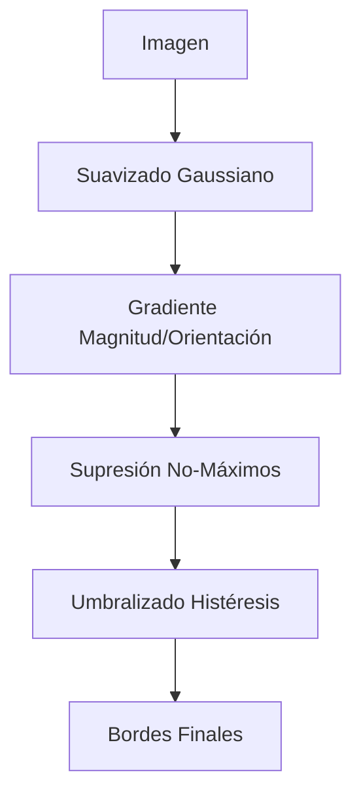

# 2. Filtros Gaussianos y Detección de Bordes

## Suavizado Gaussiano (Gaussian Smoothing)
Es un filtro paso-baja (elimina frecuencias altas/ruido) isotrópico (circularmente simétrico). Es mejor que el filtro de media (box filter) porque no introduce artefactos de borde ("ringing").

$$ G_{\sigma}(x, y) = \frac{1}{2\pi\sigma^2} e^{-\frac{x^2 + y^2}{2\sigma^2}} $$

> [!info] Leyenda Matemática
> *   $\sigma$ (Sigma): Desviación estándar. Controla el grado de suavizado. A mayor $\sigma$, más borrosa la imagen.
> *   $x, y$: Distancia al centro del kernel.
> *   $\frac{1}{2\pi\sigma^2}$: Factor de normalización (para que la suma del kernel sea 1).

### Propiedades Clave
1.  **Tamaño del Kernel:** Para capturar el 99% de la distribución, el tamaño del kernel debe ser al menos **$2 \cdot \lceil 3\sigma \rceil + 1$**.
2.  **Separabilidad:** Un filtro Gaussiano 2D se puede separar en dos filtros 1D (uno horizontal y uno vertical).
    *   *Ventaja:* Reduce la complejidad computacional de $O(M^2)$ a $O(2M)$ por píxel.

---

## Detección de Bordes
Un borde es un cambio rápido en la intensidad de la imagen.
*   **Derivada:** Mide la tasa de cambio. Los picos en la derivada indican bordes.
*   **Ruido:** La derivada amplifica el ruido. **Solución:** Suavizar (Gaussian) antes de derivar.

Debido a la asociatividad de la convolución:
$$ \frac{d}{dx}(f * g) = f * \frac{d}{dx}g $$
*Podemos convolucionar la imagen directamente con la **derivada de la Gaussiana**.*

### Gradiente de la Imagen
El gradiente $\nabla f$ es un vector que apunta a la dirección de mayor cambio.

*   **Magnitud (Fuerza del borde):** $||\nabla f|| = \sqrt{G_x^2 + G_y^2}$
*   **Dirección (Orientación):** $\theta = \tan^{-1}(G_y / G_x)$

> [!info] Leyenda
> *   $G_x$: Derivada en dirección horizontal (Filtro Sobel X).
> *   $G_y$: Derivada en dirección vertical (Filtro Sobel Y).

### Detector de Bordes de Canny (El estándar)
Algoritmo en 4 pasos:
1.  **Suavizado Gaussiano:** Reducir ruido.
2.  **Cálculo del Gradiente:** Obtener magnitud y orientación.
3.  **Supresión de no-máximos:** Adelgazar los bordes para que tengan 1 píxel de ancho (se queda solo con el pico local en la dirección del gradiente).
4.  **Umbralizado por Histéresis:**
    *   Usa dos umbrales: $T_{alto}$ y $T_{bajo}$.
    *   Si $borde > T_{alto}$: Borde fuerte (se queda).
    *   Si $borde < T_{bajo}$: No es borde (se elimina).
    *   Si $T_{bajo} < borde < T_{alto}$: Borde débil (se queda solo si está conectado a un borde fuerte).

### Laplaciana de Gaussiana (LoG)
Usa la segunda derivada. Busca los **cruces por cero** (zero-crossings) en lugar de picos.
*   **DoG (Difference of Gaussians):** Aproximación eficiente de la LoG restando dos imágenes suavizadas con Gaussianas de diferente $\sigma$.

