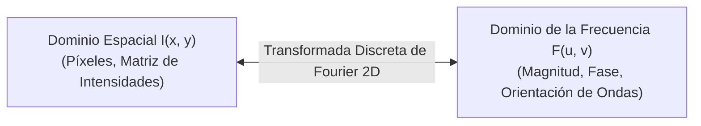
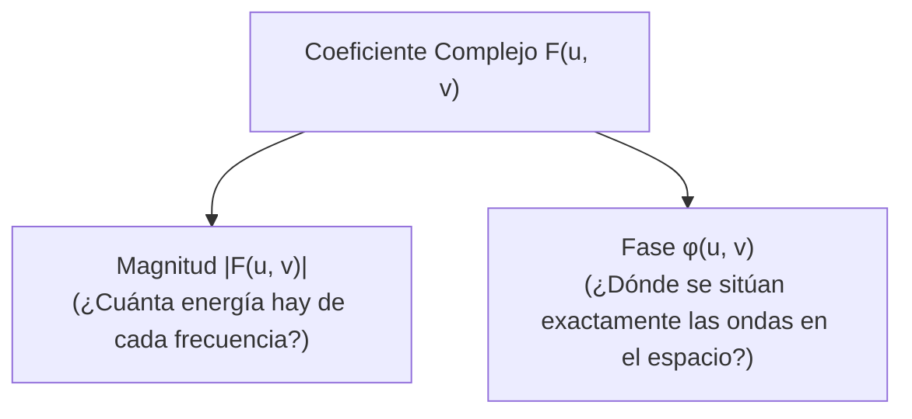
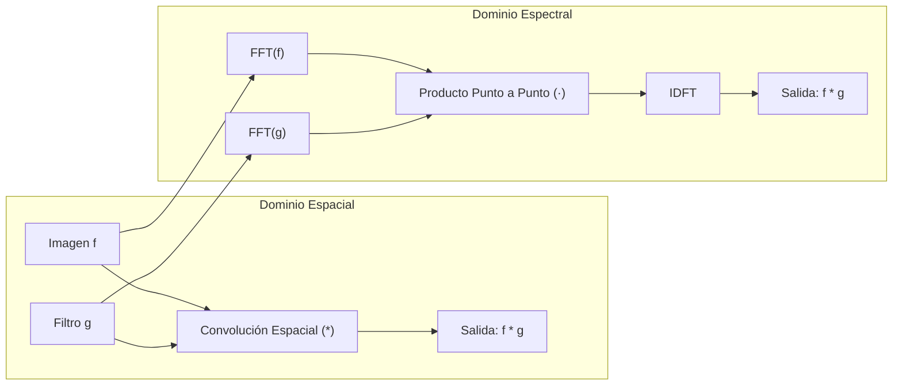
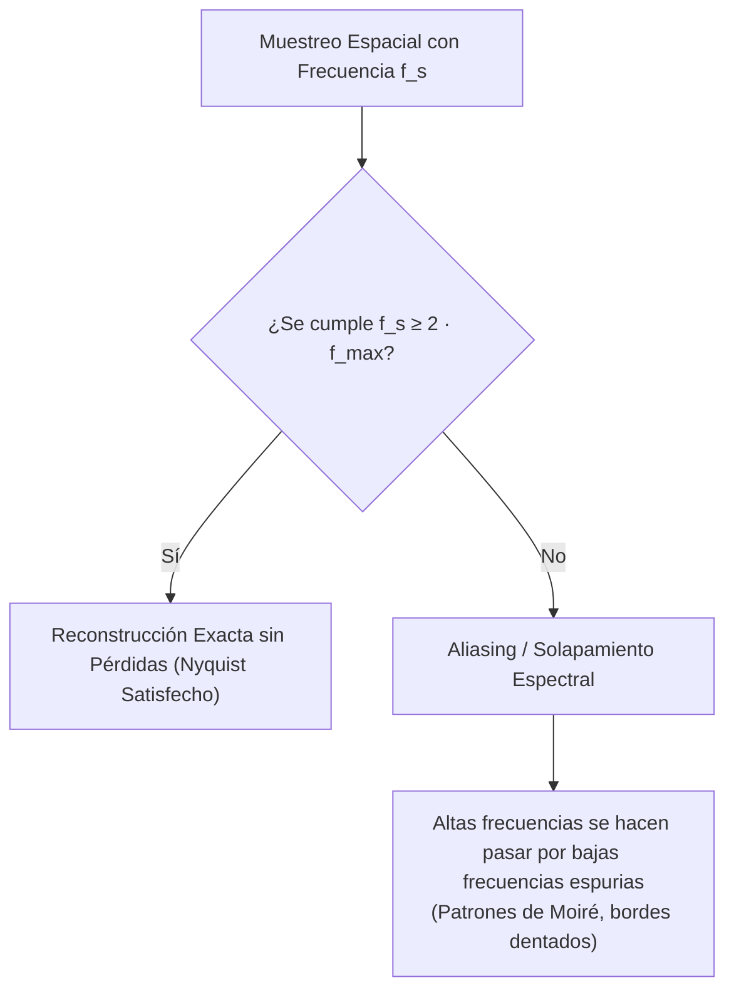

# 3. Análisis de Frecuencia en Imágenes

Este documento explora el dominio transformado de Fourier en dos dimensiones: la intuición física de las frecuencias espaciales, las ecuaciones discretas (2D-DFT y 2D-IDFT), el significado del componente DC y el centrado espectral (`fftshift`), el papel fundamental de la magnitud frente a la fase (experimento de Oppenheim & Lim), el Teorema de la Convolución y su ventaja computacional mediante FFT, la clasificación de filtros espectrales (paso-baja, paso-alta y paso-banda) y el Teorema de Muestreo de Nyquist-Shannon junto con el fenómeno de *aliasing*.

---

## 1. De la Intuición Espacial a la Frecuencia Espacial

Toda imagen digital bidimensional puede interpretarse como una superficie topográfica donde la intensidad de cada píxel representa una altura. Esta superficie puede descomponerse de forma exacta en una **superposición lineal ponderada de ondas sinusoidales 2D** orientadas en distintas direcciones y oscilando a diferentes velocidades.



### Significado de las Frecuencias Espaciales
- **Bajas Frecuencias:** Ondas de longitud amplia que varían lentamente a lo largo de la imagen. Representan áreas homogéneas, fondos lisos, el nivel de iluminación global y transiciones suaves de tonalidad.
- **Altas Frecuencias:** Ondas de longitud muy corta que oscilan rápidamente. Representan cambios abruptos de intensidad: **bordes nítidos, aristas, texturas finas, líneas delgadas y ruido de sensor**.

```text
       Frecuencia Espacial Baja                Frecuencia Espacial Alta
        (Variación suave de gris)              (Transiciones rápidas / bordes)
       ▲                                       ▲
     1 │   ╭───╮                             1 │ ╭╮╭╮╭╮╭╮╭╮╭╮╭╮
       │  ╱     ╲                              │ ││││││││││││││
     0 ┼─╱───────╲─────>                     0 ┼─╯╰╯╰╯╰╯╰╯╰╯╰╯╰─>
```

---

## 2. La Transformada Discreta de Fourier 2D (2D-DFT)

Para una imagen discreta $f(x, y)$ de dimensiones $M \times N$:

### Ecuación de Análisis (Transformada Directa, 2D-DFT)
$$ F(u, v) = \sum_{x=0}^{M-1} \sum_{y=0}^{N-1} f(x, y) \, e^{-j 2\pi \left( \frac{ux}{M} + \frac{vy}{N} \right)} $$

### Ecuación de Síntesis (Transformada Inversa, 2D-IDFT)
$$ f(x, y) = \frac{1}{MN} \sum_{u=0}^{M-1} \sum_{v=0}^{N-1} F(u, v) \, e^{j 2\pi \left( \frac{ux}{M} + \frac{vy}{N} \right)} $$

> [!info] Leyenda Matemática
> - $f(x, y)$: Intensidad del píxel en la fila $x$, columna $y$ del dominio espacial.
> - $F(u, v)$: Coeficiente complejo de Fourier en las frecuencias espaciales horizontal $u$ y vertical $v$.
> - $j = \sqrt{-1}$: Unidad imaginaria.
> - $e^{j\theta} = \cos\theta + j\sin\theta$: Fórmula de Euler que codifica la base ortogonal de senos y cosenos.
> - $\frac{1}{MN}$: Factor de normalización energética en la síntesis inversa.

---

## 3. El Componente DC y el Centrado de Frecuencias (`fftshift`)

### Significado Físico del Componente DC ($u=0, v=0$)
Al evaluar la DFT en el origen de frecuencias ($u=0, v=0$):

$$ F(0, 0) = \sum_{x=0}^{M-1} \sum_{y=0}^{N-1} f(x, y) \, e^{0} = \sum_{x=0}^{M-1} \sum_{y=0}^{N-1} f(x, y) $$

> [!important] Propiedad del Componente DC
> El valor $F(0, 0)$ equivale a la **suma total de todas las intensidades de la imagen**. Por tanto, dividido entre $MN$, representa exactamente el **brillo medio de la imagen**. En cualquier espectro, $F(0,0)$ es por órdenes de magnitud el coeficiente de mayor energía.

### Centrado Espectral (`fftshift`)
Por defecto, la implementación matemática estándar de la FFT sitúa la frecuencia cero $(0,0)$ en la esquina superior izquierda $[0, 0]$ de la matriz. Para facilitar la interpretación humana, se aplica una traslación cuadrante a cuadrante (`fftshift`) que traslada el componente DC al **centro geométrico** de la imagen:

```text
   FFT Sin Centrar (DC en esquina):           Tras fftshift (DC en centro):
   ┌──────────────┬──────────────┐            ┌──────────────┬──────────────┐
   │ DC  (+, +)   │     (-, +)   │            │   (-, -)     │    (+, -)    │
   │ Bajas frec.  │              │            │              │  Altas frec. │
   ├──────────────┼──────────────┤  ───────>  ├──────────────┼──────────────┤
   │     (+, -)   │     (-, -)   │            │              │      DC      │
   │              │              │            │  Altas frec. │  (Centro)    │
   └──────────────┴──────────────┘            └──────────────┴──────────────┘
```

---

## 4. Representación Polar: Magnitud frente a Fase

Dado que cada coeficiente $F(u, v)$ es un número complejo $R(u, v) + j I(u, v)$, puede descomponerse en forma polar:

1. **Espectro de Magnitud:**
   $$ |F(u, v)| = \sqrt{R(u, v)^2 + I(u, v)^2} $$
   - Debido al gigantesco rango dinámico entre el componente DC y las altas frecuencias, para visualizar el espectro de magnitud se aplica una escala logarítmica:
     $$ S(u, v) = \log\left( 1 + |F(u, v)| \right) $$

2. **Espectro de Fase:**
   $$ \phi(u, v) = \operatorname{atan2}(I(u, v), R(u, v)) \quad \in [-\pi, \pi] $$



### El Experimento Canónico de Intercambio de Fase (Oppenheim & Lim)
¿Qué contiene más información estructural sobre una imagen: la magnitud o la fase?

Si combinamos:
- La **Magnitud de la Imagen A** con la **Fase de la Imagen B**, y aplicamos la IDFT:
  $$\hat{I} = \operatorname{IDFT}\left( |F_A| \cdot e^{j \phi_B} \right)$$
  **El resultado visual muestra inequívocamente la Imagen B** (con artefactos de contraste y texturas de A).

> [!important] Conclusión Perceptiva
> - La **Magnitud** almacena la distribución global de frecuencias, periodicidad de texturas y rugosidad.
> - La **Fase** almacena la **coherencia espacial y localización geométrica de los bordes y formas**. La fase es la responsable de la inteligibilidad visual de la escena.

---

## 5. El Teorema de la Convolución

El Teorema de la Convolución es una de las piedras angulares del procesamiento de señales y la visión por computador:

> [!important] Enunciado del Teorema de la Convolución
> La convolución espacial entre dos señales continuas o periódicas equivale a la **multiplicación punto a punto** de sus correspondientes transformadas de Fourier:
> $$ f * g \iff \mathcal{F}\{f\} \cdot \mathcal{F}\{g\} $$
> $$ f \cdot g \iff \mathcal{F}\{f\} * \mathcal{F}\{g\} $$



### Ventaja de Complejidad Computacional (Espacio vs. Frecuencia)
Para una imagen de $N \times N$ píxeles y un kernel de convolución de tamaño $M \times M$:

- **Convolución Directa en el Espacio:**
  $$\mathcal{O}(N^2 \cdot M^2)$$
- **Convolución mediante la Transformada Rápida de Fourier (FFT):**
  1. $\operatorname{FFT}(I)$ de coste $\mathcal{O}(N^2 \log N)$.
  2. Multiplicación matricial elemento a elemento de coste $\mathcal{O}(N^2)$.
  3. $\operatorname{IDFT}$ de coste $\mathcal{O}(N^2 \log N)$.
  $$\text{Coste Total: } \mathcal{O}(N^2 \log N)$$

> [!tip] Regla Práctica de Implementación
> - Para kernels pequeños (ej. $3 \times 3$, $5 \times 5$, $7 \times 7$ como Sobel o Canny), la convolución directa en el espacio es mucho más rápida debido a los costes constantes del padding y la FFT.
> - Para kernels de gran tamaño espacial ($M \ge 31$), el filtrado por FFT en el dominio frecuencial es radicalmente más rápido.

---

## 6. Clasificación de Filtros en Frecuencia

Al multiplicar la imagen por una función de transferencia de filtro $H(u, v)$ en frecuencia:
$$ G(u, v) = F(u, v) \cdot H(u, v) $$

| Tipo de Filtro | Función de Transferencia $H(u, v)$ | Efecto Visual en la Imagen | Ejemplos |
| :--- | :--- | :--- | :--- |
| **Paso-Baja (*Low-Pass*)** | Conserva coeficientes cerca del centro ($u,v \approx 0$) y atenúa las frecuencias lejanas. | Suavizado, emborronamiento, reducción de ruido y pérdida de nitidez en bordes. | Filtro Gaussiano, Box Filter. |
| **Paso-Alta (*High-Pass*)** | Bloquea el componente DC y frecuencias bajas; amplifica frecuencias exteriores. | Elimina zonas lisas; resalta bordes, contornos, transiciones y ruido fino. | Operador Laplaciano, Derivadas espaciales. |
| **Paso-Banda (*Band-Pass*)** | Atenúa simultáneamente muy bajas y muy altas frecuencias, dejando pasar una banda intermedia. | Resalta estructuras de una escala espacial concreta, ignorando el fondo y el ruido. | Diferencia de Gaussianas (DoG), LoG, Filtros de Gabor. |

---

## 7. Muestreo, Aliasing y Teorema de Nyquist-Shannon

Al reducir el tamaño de una imagen (*downsampling* o decimación) para procesarla o construir una pirámide de escala, estamos tomando muestras discretas más espaciadas de una señal previa.



### El Teorema de Muestreo de Nyquist-Shannon
Para poder reconstruir una señal continua o muestreada sin pérdidas ni distorsión, la **frecuencia de muestreo $f_s$** debe ser estrictamente mayor que el doble de la máxima frecuencia $f_{\max}$ presente en la señal original:

$$ f_s \ge 2 \, f_{\max} $$

> [!info] Leyenda Matemática
> - $f_s$: Frecuencia de muestreo (número de muestras tomadas por unidad de distancia espacial).
> - $f_{\max}$: Ancho de banda o componente frecuencial más alta contenida en la señal analizada.
> - $f_{Nyquist} = \frac{f_s}{2}$: Límite de Nyquist. Cualquier componente por encima de este umbral sufrirá aliasing.

### Fenómeno de *Aliasing* y Patrones de Moiré
Cuando se muestrea por debajo del límite de Nyquist ($f_s < 2 f_{\max}$), las réplicas del espectro en el dominio transformado se solapan entre sí. Como consecuencia, las altas frecuencias no desaparecen, sino que **se repliegan adoptando la identidad de frecuencias bajas artificiales inexistentes en la escena real**, manifestándose como:
- **Efecto Moiré:** Ondulaciones y bandas geométricas extrañas sobre texturas repetitivas (ej. telas rayadas, ladrillos, rejas).
- **Escalonamiento (*Jagged Edges*):** Bordes diagonales transformados en dientes de sierra pronunciados.

> [!important] Regla Obligatoria Anti-Aliasing
> **Nunca decimes una imagen directamente eliminando filas y columnas alternas.** Siempre debe aplicarse un **filtro paso-baja (suavizado gaussiano)** antes de reducir la resolución para eliminar todas las componentes que superen la nueva frecuencia de Nyquist.

---

## 8. Conexión Conceptual con el Temario

- **Fundamentos previos:** En [[1. Representacion y Filtrado]], se demostró la asociatividad de la convolución que hoy explicamos mediante el producto de Fourier.
- **Bordes y Derivadas:** En [[2. Gaussianas y Bordes]], vimos que el detector de Canny y los filtros LoG operan en bandas específicas de alta y media frecuencia.
- **Estructuras Multiescala:** En [[4. Piramides y Escala]], utilizaremos el suavizado gaussiano anti-aliasing como paso obligatorio de decimación para la construcción de pirámides multirresolución.
- **Autoevaluación:** En [[5. Ejercicios y Preguntas de Examen]], encontrarás ejercicios resueltos sobre la respuesta espectral y propiedades de invariancia de filtros.

---

### 📚 Referencias Bibliográficas

- **Szeliski, Richard** (2022). *Computer Vision: Algorithms and Applications* (2nd ed.). Springer.
  - **Capítulo / Sección:** Chapter 3: Image processing $\to$ Section 3.4: *Fourier transforms*.
  - **Archivo local:** [[docs_clase/textBook/Szeliski/Chapter_3_Image_processing/3.4_Fourier_transforms.md|Szeliski - Chapter 3.4 Fourier transforms]].
- **Forsyth, David A.; Ponce, Jean** (2012). *Computer Vision: A Modern Approach* (2nd ed.). Pearson.
  - **Capítulo / Sección:** Chapter 4: Linear Filters $\to$ Section 4.3: *Spatial Frequency and Fourier Transforms* y Section 4.4: *Sampling and Aliasing*.
  - **Archivo local:** [[docs_clase/textBook/Forsyth_Ponce/4_Linear_Filters/4.3_Spatial_Frequency_and_Fourier_Transforms.md|Forsyth & Ponce - Chapter 4.3 Spatial Frequency and Fourier Transforms]] y [[docs_clase/textBook/Forsyth_Ponce/4_Linear_Filters/4.4_Sampling_and_Aliasing.md|Chapter 4.4 Sampling and Aliasing]].
- **Torralba, Antonio; Isola, Phillip; Freeman, William T.** (2024). *Foundations of Computer Vision*. MIT Press.
  - **Capítulo / Sección:** Blur Filters $\to$ *Fourier Transform of Box and Gaussian Filters*.
  - **Archivo local:** [[docs_clase/textBook/Torralba_Foundations/blurring_2.md|Torralba - Fourier Transform of Blur Filters]].
- **Oppenheim, Alan V.; Lim, Jae S.** (1981). *The importance of phase in signals*. Proceedings of the IEEE, 69(5), 529-541.
