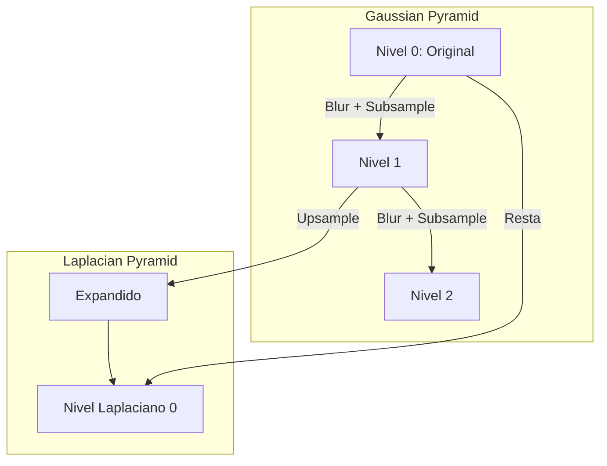

# 4. Pirámides y Escala

## Espacio de Escala (Scale-space)
Las imágenes tienen estructuras a diferentes escalas (ej: las hojas de un árbol vs. el bosque entero). No existe una escala "correcta". Necesitamos procesar imágenes a múltiples escalas.

## Pirámide Gaussiana
Estructura para representar la imagen a múltiples resoluciones.
**Proceso de construcción (Downsampling):**
1.  **Blur:** Aplicar filtro Gaussiano (Paso-baja) para eliminar altas frecuencias y evitar aliasing.
2.  **Subsample:** Eliminar filas y columnas pares (reducir tamaño a la mitad).
3.  Repetir iterativamente.

*Resultado:* Una serie de imágenes $G_0, G_1, G_2...$ donde $G_0$ es la original y las siguientes son versiones reducidas y suavizadas.

## Pirámide Laplaciana
Permite reconstruir la imagen original desde las versiones comprimidas. Guarda la "información perdida" en cada nivel de la pirámide Gaussiana (los detalles/altas frecuencias).

**Construcción:**
1.  Tomar un nivel de la Gaussiana $G_i$.
2.  Expandir (Upsample) el nivel superior $G_{i+1}$ y suavizarlo.
3.  Restar: $L_i = G_i - \text{Expand}(G_{i+1})$.

*Aplicaciones:*
*   **Compresión de imágenes:** Los niveles Laplacianos tienen valores cercanos a cero (baja entropía), fáciles de comprimir.
*   **Fusión de imágenes (Blending):** Mezclar imágenes a diferentes frecuencias para evitar costuras visibles (ej: unir dos caras o insertar objetos).

## Interpolación (Upsampling)
Necesaria para ampliar imágenes o recuperar niveles en pirámides.
1.  **Vecino más cercano:** Bloques pixelados.
2.  **Bilineal:** Promedio ponderado de los 4 vecinos más cercanos. Suave pero borroso.
3.  **Bicúbica:** Considera 16 vecinos. Más nítido, computacionalmente más costoso.
