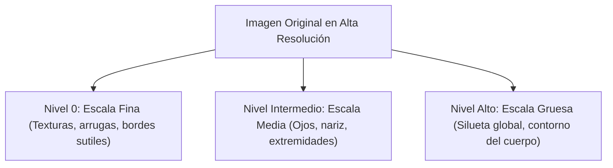
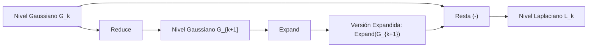
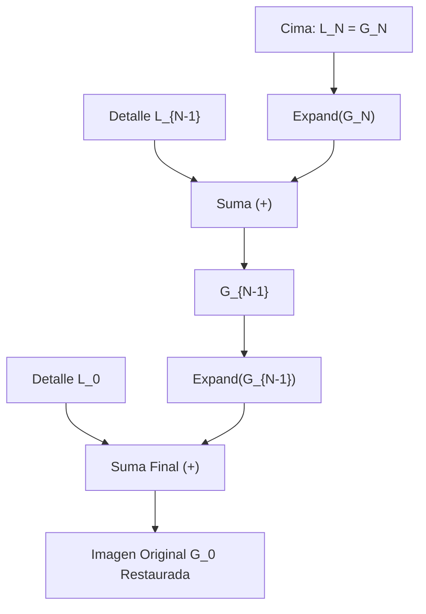
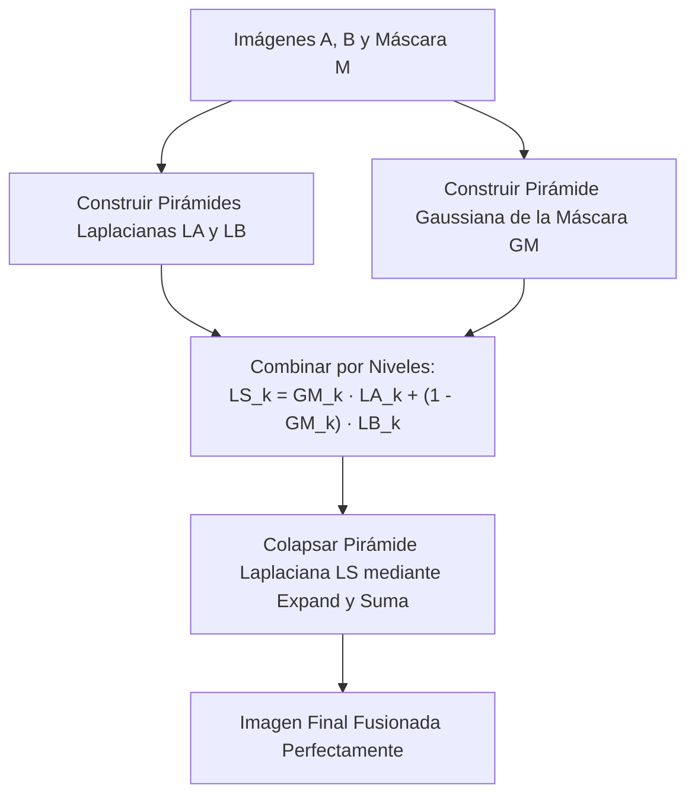
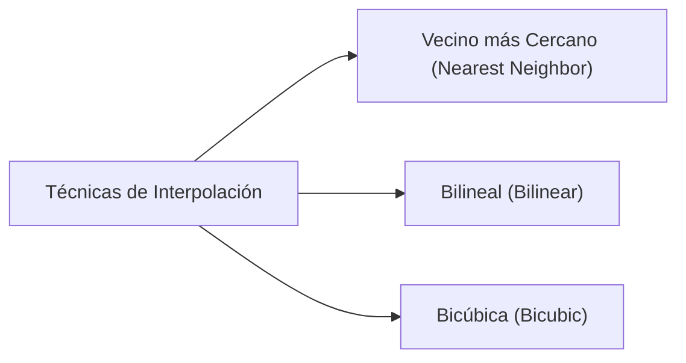

# 4. Pirámides de Imágenes y Teoría de Escala

Este documento desarrolla la teoría multirresolución y del espacio de escala (*scale-space*): la necesidad de representar una escena a múltiples niveles de detalle, la formulación matemática de las pirámides Gaussianas y Laplacianas (operadores `Reduce` y `Expand`), el teorema de reconstrucción exacta sin pérdidas, el algoritmo canónico de fusión multirresolución de Burt y Adelson (*Spline Blending*), y la comparación analítica de los métodos de interpolación espacial continua (vecino más cercano, bilineal y bicúbica).

---

## 1. La Necesidad del Análisis Multiescala

En el mundo físico, los objetos y las estructuras no poseen un tamaño fijo en la imagen proyectada:
- Un mismo rostro puede ocupar $500 \times 500$ píxeles (en primer plano) o solo $20 \times 20$ píxeles (a lo lejos).
- Si diseñamos un detector de esquinas o bordes con un kernel de tamaño fijo (ej. $5 \times 5$), sólo capturará detalles a esa escala geométrica particular, fallando ante variaciones de distancia o resolución.



### Teoría del Espacio de Escala (*Scale-Space Theory*)
Introducida por Andrew Witkin (1983) y formalizada por Jan Koenderink (1984), establece que la única familia lineal de operadores que genera una representación multiescala continua **sin introducir nuevos falsos detalles ni estructuras espurias (*causalidad de escala*)** es la familia de funciones gaussianas:

$$ L(x, y; \sigma) = I(x, y) * G_\sigma(x, y) $$

---

## 2. La Pirámide Gaussiana (Burt & Adelson, 1983)

La **pirámide gaussiana** es una representación jerárquica discreta multirresolución donde cada nivel sucesivo tiene la mitad de ancho y alto que el anterior, recordando a una pirámide truncada escalonada.

```text
               Nivel 3 (64x64)      ▲ Escala gruesa (bajas frecuencias)
                 ┌────────┐         │
           Nivel 2 (128x128)        │  REDUCE:
            ┌────────────────┐      │  1. Suavizado paso-baja (G_σ)
       Nivel 1 (256x256)            │  2. Decimación espacial 2x
        ┌────────────────────────┐  │
   Nivel 0 (512x512) - Original     │
    ┌────────────────────────────────┐
                                    ▼ Escala fina (altas frecuencias)
```

### El Operador `Reduce`
Para pasar del nivel $k$ al nivel subsiguiente más pequeño $k+1$, se aplican dos pasos estrictamente en orden:

$$ G_{k+1} = \operatorname{Reduce}(G_k) = \left( G_k * W \right) \downarrow 2 $$

1. **Filtrado Paso-Baja (Anti-Aliasing):** Se convoluciona con un kernel gaussiano $5 \times 5$ simétrico y normalizado:
   $$ W = \frac{1}{256} \begin{bmatrix} 1 & 4 & 6 & 4 & 1 \\ 4 & 16 & 24 & 16 & 4 \\ 6 & 24 & 36 & 24 & 6 \\ 4 & 16 & 24 & 16 & 4 \\ 1 & 4 & 6 & 4 & 1 \end{bmatrix} = \frac{1}{16} \begin{bmatrix} 1 \\ 4 \\ 6 \\ 4 \\ 1 \end{bmatrix} * \frac{1}{16} \begin{bmatrix} 1 & 4 & 6 & 4 & 1 \end{bmatrix} $$
2. **Submuestreo / Decimación Espacial ($\downarrow 2$):** Se descartan una de cada dos filas y una de cada dos columnas:
   $$ G_{k+1}(i, j) = \sum_{m=-2}^2 \sum_{n=-2}^2 w(m, n) \, G_k(2i + m, 2j + n) $$

### Sobrecoste de Memoria
A pesar de almacenar múltiples resoluciones, la pirámide gaussiana requiere muy poca memoria adicional gracias a la convergencia geométrica:

$$ \text{Memoria Total} = N^2 \left( 1 + \frac{1}{4} + \frac{1}{16} + \frac{1}{64} + \dots \right) = N^2 \sum_{k=0}^{\infty} \left(\frac{1}{4}\right)^k = N^2 \cdot \frac{1}{1 - 1/4} = \frac{4}{3} N^2 $$

> [!important] Huella de Memoria
> Toda la pirámide gaussiana completa solo ocupa un **$33.3\%$** más de memoria que la imagen original individual.

---

## 3. La Pirámide Laplaciana

Mientras que la pirámide gaussiana almacena versiones progresivamente suavizadas (paso-baja), la **pirámide laplaciana** almacena la **información de detalle o diferencias (paso-banda)** que se pierde entre un nivel y el siguiente.



### El Operador `Expand`
Para comparar un nivel reducido $G_{k+1}$ con su predecesor $G_k$, es necesario duplicar sus dimensiones espaciales ($2\times$):

$$ \operatorname{Expand}(G)(i, j) = 4 \sum_{m=-2}^2 \sum_{n=-2}^2 w(m, n) \, G\left( \frac{i-m}{2}, \frac{j-n}{2} \right) $$

1. **Upsampling:** Se insertan filas y columnas alternas de ceros (interpolación por ceros).
2. **Interpolación:** Se convoluciona con el filtro gaussiano escalado por $4$ para interpolar suavemente los valores intercalados conservando la energía lumínica.

### Definición Analítica del Nivel Laplaciano
$$ L_k = G_k - \operatorname{Expand}(G_{k+1}) $$

El último nivel de la pirámide laplaciana (la cima) es directamente la imagen más pequeña de la pirámide gaussiana:
$$ L_N = G_N $$

---

## 4. Reconstrucción Exacta sin Pérdidas (*Lossless Collapse*)

Una de las propiedades matemáticas más elegantes de la pirámide laplaciana es que **permite recuperar la imagen original exactamente píxel a píxel**, invirtiendo la resta en sentido ascendente:

$$ G_k = L_k + \operatorname{Expand}(G_{k+1}) $$



> [!important] Naturaleza Paso-Banda de la Pirámide Laplaciana
> La pirámide laplaciana es una descomposición ortogonal por bandas de frecuencia:
> - $L_0$ contiene los bordes y texturas ultrafinas.
> - $L_1$ contiene estructuras y transiciones medias.
> - $L_N$ contiene la iluminación global y fondos planos.

---

## 5. Fusión Multirresolución (*Multiresolution Spline Blending*)

Diseñado por Burt y Adelson en 1983, este algoritmo resuelve el problema de unir dos imágenes (ej. una manzana y una naranja, o un panorama de dos fotografías) eliminando las costuras visibles y las transiciones bruscas sin generar dobles imágenes fantasma (*ghosting*).

```text
               Problemas del Blending Simple:
   Corte Abrupto (Costura dura)          Transición Lineal (Costura fantasma)
   ┌──────────┬──────────┐               ┌──────────░░░░──────────┐
   │ Imagen A │ Imagen B │               │ Imagen A ░░░░ Imagen B │
   └──────────┴──────────┘               └──────────░░░░──────────┘
      Línea de unión visible               Doble exposición en el borde
```

### Algoritmo Paso a Paso
Dadas dos imágenes $A$ y $B$, y una máscara binaria de corte $M$ ($M=1$ donde se toma $A$ y $M=0$ donde se toma $B$):



1. **Construcción de Pirámides Laplacianas:** Construir $LA$ a partir de $A$, y $LB$ a partir de $B$.
2. **Construcción de Pirámide Gaussiana de la Máscara:** Construir $GM$ a partir de $M$. Al suavizarse la máscara con gaussianas a escalas crecientes, la anchura de la franja de transición se adapta de forma matemáticamente exacta al tamaño de las frecuencias presentes en cada nivel $k$.
3. **Mezcla Nivel a Nivel:**
   $$ LS_k(i, j) = GM_k(i, j) \cdot LA_k(i, j) + \left(1 - GM_k(i, j)\right) \cdot LB_k(i, j) $$
4. **Reconstrucción:** Reconstruir recursivamente la imagen final a partir de la pirámide combinada $LS$.

---

## 6. Métodos de Interpolación Espacial

Al ampliar una imagen (*upsampling*) o aplicar transformaciones geométricas (rotaciones, distorsiones de perspectiva), es obligatorio evaluar intensidades en coordenadas fraccionarias no enteras $(x, y) \notin \mathbb{Z}^2$.



| Método de Interpolación | Soporte Espacial | Complejidad | Calidad Visual y Propiedades |
| :--- | :---: | :---: | :--- |
| **Vecino más Cercano (*Nearest Neighbor*)** | $1 \times 1$ píxel | $\mathcal{O}(1)$ (Instantánea) | Redondea a la coordenada entera más próxima. Genera artefactos de pixelado y bordes en bloque (*blocky appearance*). |
| **Bilineal (*Bilinear*)** | $2 \times 2$ píxeles ($4$ vecinos) | Moderada | Realiza una interpolación lineal primero horizontal y luego vertical: $f(x, y) \approx (1-u)(1-v)I_{00} + u(1-v)I_{10} + (1-u)v I_{01} + uv I_{11}$. Transición suave pero tiende a desenfocar ligeramente. |
| **Bicúbica (*Bicubic*)** | $4 \times 4$ píxeles ($16$ vecinos) | Alta | Emplea splines polinómicos cúbicos de tercer orden. Preserva aristas nítidas con gradientes continuos, evitando el emborronamiento excesivo. Estándar de calidad en producción. |

---

## 7. Conexión Conceptual con el Temario

- **Fundamentos Previos:** En [[1. Representacion y Filtrado]], aprendimos las propiedades básicas de los sistemas lineales y las operaciones de convolución.
- **Operadores Diferenciales:** En [[2. Gaussianas y Bordes]], vimos que la diferencia de gaussianas (DoG) aproxima a la LoG; una pirámide laplaciana es esencialmente un banco de filtros DoG muestreado a diferentes escalas.
- **Teoría Espectral:** En [[3. Analisis de Frecuencia]], formalizamos el Teorema de Nyquist que fundamenta la necesidad del filtro anti-aliasing en el operador `Reduce`.
- **Casos Prácticos de Examen:** En [[5. Ejercicios y Preguntas de Examen]], encontrarás ejercicios resueltos sobre el cálculo de soporte espacial, sigma equivalente y filtros combinados.

---

### 📚 Referencias Bibliográficas

- **Szeliski, Richard** (2022). *Computer Vision: Algorithms and Applications* (2nd ed.). Springer.
  - **Capítulo / Sección:** Chapter 3: Image processing $\to$ Section 3.5: *Pyramids and wavelets*.
  - **Archivo local:** [[docs_clase/textBook/Szeliski/Chapter_3_Image_processing/3.5_Pyramids_and_wavelets.md|Szeliski - Chapter 3.5 Pyramids and wavelets]].
- **Forsyth, David A.; Ponce, Jean** (2012). *Computer Vision: A Modern Approach* (2nd ed.). Pearson.
  - **Capítulo / Sección:** Chapter 4: Linear Filters $\to$ Section 4.7: *Technique: Scale and Image Pyramids*.
  - **Archivo local:** [[docs_clase/textBook/Forsyth_Ponce/4_Linear_Filters/4.7_Technique_Scale_and_Image_Pyramids.md|Forsyth & Ponce - Chapter 4.7 Scale and Image Pyramids]].
- **Burt, Peter J.; Adelson, Edward H.** (1983). *The Laplacian Pyramid as a Compact Image Code*. IEEE Transactions on Communications, 31(4), 532-540.
- **Burt, Peter J.; Adelson, Edward H.** (1983). *A multiresolution spline with application to image mosaics*. ACM Transactions on Graphics (TOG), 2(4), 217-236.
